# Technical Specifications

## 1. INTRODUCTION

### EXECUTIVE SUMMARY

| Aspect | Description |
|--------|-------------|
| Project Overview | A simple Node.js HTTP server application that exposes a single REST endpoint `/hello` which returns "Hello world" to clients |
| Business Problem | Provides a minimal, functional example of a Node.js web service that can serve as a learning tool or starter template |
| Key Stakeholders | Developers learning Node.js, technical trainers, software engineers requiring a baseline implementation |
| Value Proposition | Demonstrates fundamental Node.js web service concepts with minimal complexity, enabling rapid learning and implementation |

### SYSTEM OVERVIEW

#### Project Context

The Node.js Hello World service operates as a standalone web application that demonstrates core Node.js HTTP server capabilities. It serves as:

- An educational tool for developers new to Node.js
- A reference implementation for basic HTTP service patterns
- A starting point for more complex Node.js applications
- A testing tool for HTTP client implementations

#### High-Level Description

| Component | Description |
|-----------|-------------|
| Primary Capabilities | HTTP request handling, response generation, and server lifecycle management |
| Major Components | Node.js runtime, HTTP server module, route handler for `/hello` endpoint |
| Technical Approach | RESTful API design principles with minimal dependencies, focusing on Node.js core modules |

#### Success Criteria

| Criteria Type | Description |
|---------------|-------------|
| Measurable Objectives | - Server successfully starts and listens on configured port<br>- `/hello` endpoint returns "Hello world" with 200 status code<br>- Documentation enables new users to run the application |
| Critical Success Factors | - Simplicity and clarity of implementation<br>- Reliability of the HTTP response<br>- Accessibility for beginners |
| Key Performance Indicators | - Time to implement<br>- Lines of code<br>- Number of dependencies |

### SCOPE

#### In-Scope

**Core Features and Functionalities:**
- HTTP server implementation using Node.js
- Single REST endpoint (`/hello`) returning a text response
- Server configuration (port, host)
- Basic error handling
- Startup and shutdown procedures

**Implementation Boundaries:**
- Single-server deployment model
- Local development environment
- Command-line interface for server management
- HTTP protocol support

#### Out-of-Scope

- Authentication and authorization mechanisms
- Database integration
- Multiple endpoints beyond `/hello`
- Request validation or complex error handling
- Logging infrastructure
- Performance optimization
- Production deployment configurations
- HTTPS/TLS support
- Load balancing or clustering
- Containerization
- Continuous integration/deployment pipelines
- Monitoring or observability features

## 2. PRODUCT REQUIREMENTS

### FEATURE CATALOG

#### Feature Metadata

| ID | Feature Name | Feature Category | Priority Level | Status |
|----|--------------|------------------|----------------|--------|
| F-001 | HTTP Server | Core Infrastructure | Critical | Approved |
| F-002 | Hello Endpoint | API | Critical | Approved |
| F-003 | Server Configuration | Configuration | High | Approved |
| F-004 | Error Handling | Reliability | Medium | Approved |

#### Feature Descriptions

**F-001: HTTP Server**

| Aspect | Description |
|--------|-------------|
| Overview | A Node.js HTTP server that listens for incoming requests |
| Business Value | Provides the foundation for serving HTTP content to clients |
| User Benefits | Enables developers to understand basic Node.js server implementation |
| Technical Context | Uses Node.js core HTTP module to create and manage server lifecycle |

**F-002: Hello Endpoint**

| Aspect | Description |
|--------|-------------|
| Overview | REST endpoint at path `/hello` that returns "Hello world" text response |
| Business Value | Demonstrates basic HTTP request/response handling |
| User Benefits | Provides a working example of route handling in Node.js |
| Technical Context | Implements request routing and response generation |

**F-003: Server Configuration**

| Aspect | Description |
|--------|-------------|
| Overview | Configuration for server port and host settings |
| Business Value | Enables flexibility in deployment environments |
| User Benefits | Allows customization of server network parameters |
| Technical Context | Manages environment-specific server settings |

**F-004: Error Handling**

| Aspect | Description |
|--------|-------------|
| Overview | Basic error handling for server startup and request processing |
| Business Value | Improves reliability and troubleshooting |
| User Benefits | Provides clear feedback when errors occur |
| Technical Context | Implements error catching and appropriate HTTP status codes |

#### Dependencies

**F-001: HTTP Server**

| Dependency Type | Description |
|-----------------|-------------|
| System Dependencies | Node.js runtime environment |
| External Dependencies | None |
| Integration Requirements | None |

**F-002: Hello Endpoint**

| Dependency Type | Description |
|-----------------|-------------|
| Prerequisite Features | F-001 HTTP Server |
| System Dependencies | None |
| External Dependencies | None |
| Integration Requirements | None |

**F-003: Server Configuration**

| Dependency Type | Description |
|-----------------|-------------|
| Prerequisite Features | F-001 HTTP Server |
| System Dependencies | None |
| External Dependencies | None |
| Integration Requirements | None |

**F-004: Error Handling**

| Dependency Type | Description |
|-----------------|-------------|
| Prerequisite Features | F-001 HTTP Server, F-002 Hello Endpoint |
| System Dependencies | None |
| External Dependencies | None |
| Integration Requirements | None |

### FUNCTIONAL REQUIREMENTS TABLE

**F-001: HTTP Server**

| Requirement ID | Description | Acceptance Criteria | Priority |
|----------------|-------------|---------------------|----------|
| F-001-RQ-001 | The system shall create an HTTP server using Node.js | Server initializes without errors | Must-Have |
| F-001-RQ-002 | The server shall listen on a specified port | Server binds to port and accepts connections | Must-Have |
| F-001-RQ-003 | The server shall handle incoming HTTP requests | Server receives and processes HTTP requests | Must-Have |

**F-002: Hello Endpoint**

| Requirement ID | Description | Acceptance Criteria | Priority |
|----------------|-------------|---------------------|----------|
| F-002-RQ-001 | The system shall implement a `/hello` endpoint | Requests to `/hello` return a response | Must-Have |
| F-002-RQ-002 | The `/hello` endpoint shall return "Hello world" text | Response body contains exactly "Hello world" | Must-Have |
| F-002-RQ-003 | The `/hello` endpoint shall return HTTP 200 status code | Response status code is 200 | Must-Have |

**F-003: Server Configuration**

| Requirement ID | Description | Acceptance Criteria | Priority |
|----------------|-------------|---------------------|----------|
| F-003-RQ-001 | The system shall use configurable port settings | Server starts on the configured port | Should-Have |
| F-003-RQ-002 | The system shall use configurable host settings | Server binds to the configured host | Should-Have |
| F-003-RQ-003 | The system shall use default values when configuration is not provided | Server starts with default settings when not specified | Should-Have |

**F-004: Error Handling**

| Requirement ID | Description | Acceptance Criteria | Priority |
|----------------|-------------|---------------------|----------|
| F-004-RQ-001 | The system shall handle server startup errors | Appropriate error messages displayed on startup failure | Should-Have |
| F-004-RQ-002 | The system shall handle request processing errors | Error responses sent for malformed requests | Could-Have |

### Technical Specifications

**F-001: HTTP Server**

| Aspect | Specification |
|--------|---------------|
| Input Parameters | None |
| Output/Response | HTTP server instance |
| Performance Criteria | Server startup time < 1 second |
| Data Requirements | None |

**F-002: Hello Endpoint**

| Aspect | Specification |
|--------|---------------|
| Input Parameters | HTTP GET request to `/hello` path |
| Output/Response | HTTP 200 response with "Hello world" text |
| Performance Criteria | Response time < 100ms |
| Data Requirements | None |

**F-003: Server Configuration**

| Aspect | Specification |
|--------|---------------|
| Input Parameters | PORT (default: 3000), HOST (default: localhost) |
| Output/Response | None |
| Performance Criteria | None |
| Data Requirements | None |

**F-004: Error Handling**

| Aspect | Specification |
|--------|---------------|
| Input Parameters | Error events from server or request processing |
| Output/Response | Console error messages, appropriate HTTP status codes |
| Performance Criteria | None |
| Data Requirements | None |

### FEATURE RELATIONSHIPS

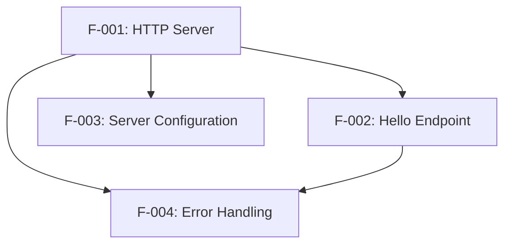
```mermaid
graph TD
    F001[F-001: HTTP Server] --> F002[F-002: Hello Endpoint]
    F001 --> F003[F-003: Server Configuration]
    F001 --> F004[F-004: Error Handling]
    F002 --> F004
```

### IMPLEMENTATION CONSIDERATIONS

**F-001: HTTP Server**

| Consideration | Description |
|---------------|-------------|
| Technical Constraints | Use Node.js core modules only |
| Performance Requirements | None for tutorial implementation |
| Scalability Considerations | None for tutorial implementation |
| Security Implications | None for basic implementation |
| Maintenance Requirements | Minimal, focused on code clarity |

**F-002: Hello Endpoint**

| Consideration | Description |
|---------------|-------------|
| Technical Constraints | Implement using URL path matching |
| Performance Requirements | None for tutorial implementation |
| Scalability Considerations | None for tutorial implementation |
| Security Implications | None for basic implementation |
| Maintenance Requirements | Minimal, focused on code clarity |

**F-003: Server Configuration**

| Consideration | Description |
|---------------|-------------|
| Technical Constraints | Use environment variables or defaults |
| Performance Requirements | None |
| Scalability Considerations | None for tutorial implementation |
| Security Implications | None for basic implementation |
| Maintenance Requirements | Minimal, focused on code clarity |

**F-004: Error Handling**

| Consideration | Description |
|---------------|-------------|
| Technical Constraints | Use standard Node.js error handling patterns |
| Performance Requirements | None |
| Scalability Considerations | None for tutorial implementation |
| Security Implications | Avoid exposing system details in error messages |
| Maintenance Requirements | Minimal, focused on code clarity |

### TRACEABILITY MATRIX

| Requirement ID | Feature ID | Priority | Status |
|----------------|-----------|----------|--------|
| F-001-RQ-001 | F-001 | Must-Have | Approved |
| F-001-RQ-002 | F-001 | Must-Have | Approved |
| F-001-RQ-003 | F-001 | Must-Have | Approved |
| F-002-RQ-001 | F-002 | Must-Have | Approved |
| F-002-RQ-002 | F-002 | Must-Have | Approved |
| F-002-RQ-003 | F-002 | Must-Have | Approved |
| F-003-RQ-001 | F-003 | Should-Have | Approved |
| F-003-RQ-002 | F-003 | Should-Have | Approved |
| F-003-RQ-003 | F-003 | Should-Have | Approved |
| F-004-RQ-001 | F-004 | Should-Have | Approved |
| F-004-RQ-002 | F-004 | Could-Have | Approved |

### 3. TECHNOLOGY STACK

#### 3.1 PROGRAMMING LANGUAGES

| Language | Version | Component | Justification |
|----------|---------|-----------|---------------|
| JavaScript | ES6+ | Server | Industry standard for Node.js development with widespread support and extensive ecosystem |
| Node.js | 18.x LTS | Runtime | Long-term support version offering stability, performance, and security updates |

Node.js is the optimal choice for this simple HTTP server implementation as it provides built-in HTTP modules that require minimal configuration to create a functional web server. The event-driven, non-blocking I/O model of Node.js makes it particularly well-suited for lightweight web services.

#### 3.2 FRAMEWORKS & LIBRARIES

| Framework/Library | Version | Purpose | Justification |
|-------------------|---------|---------|---------------|
| Node.js Core HTTP | Built-in | HTTP server | Native module eliminates external dependencies while providing all necessary functionality for this simple use case |

For this minimal implementation, no external web frameworks (like Express.js) are required. The Node.js core HTTP module provides all necessary functionality to create a simple server and handle the `/hello` endpoint, adhering to the principle of minimal dependencies outlined in the project requirements.

#### 3.3 OPEN SOURCE DEPENDENCIES

No third-party open source dependencies are required for this implementation. The application will use only Node.js core modules, specifically:

| Module | Source | Purpose |
|--------|--------|---------|
| http | Node.js Core | Creating and managing the HTTP server |
| url | Node.js Core | Parsing and handling URL paths |

This zero-dependency approach simplifies installation, reduces security risks, and aligns with the educational purpose of the application as a learning tool.

#### 3.4 DEVELOPMENT & DEPLOYMENT

| Tool/Technology | Version | Purpose | Justification |
|-----------------|---------|---------|---------------|
| npm | 9.x+ | Package management | Standard package manager for Node.js ecosystem |
| nodemon | 2.x (dev only) | Development server | Optional development dependency for automatic server restarts during development |
| Git | 2.x+ | Version control | Industry standard for source code management |

Development will focus on simplicity with minimal tooling. The application can be run directly with the Node.js runtime without complex build steps. Nodemon may be used as an optional development dependency to improve the development experience but is not required for production.

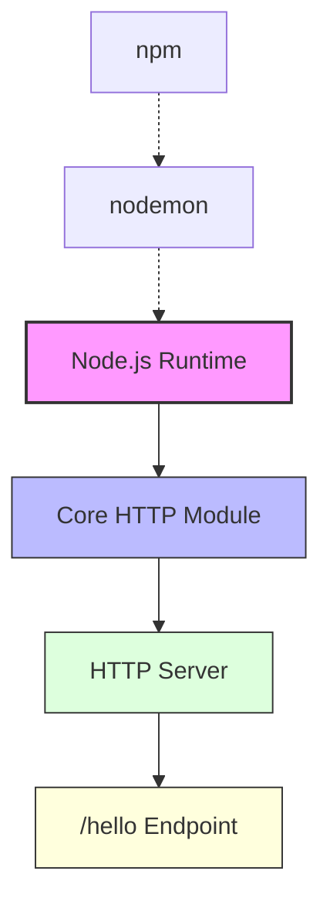
```mermaid
graph TD
A[Node.js Runtime] --> B[Core HTTP Module]
B --> C[HTTP Server]
C --> D["/hello Endpoint"]
E[npm] -.-> F[nodemon]
F -.-> A

style A fill:#f9f,stroke:#333,stroke-width:2px
style B fill:#bbf,stroke:#333,stroke-width:1px
style C fill:#dfd,stroke:#333,stroke-width:1px
style D fill:#ffd,stroke:#333,stroke-width:1px
```

Note: The sections for THIRD-PARTY SERVICES and DATABASES & STORAGE have been intentionally omitted as they are not applicable to this simple HTTP server implementation, which requires no external services, databases, or storage solutions.

## 4. PROCESS FLOWCHART

### 4.1 SYSTEM WORKFLOWS

#### 4.1.1 Core Business Processes

**HTTP Request Processing Workflow**

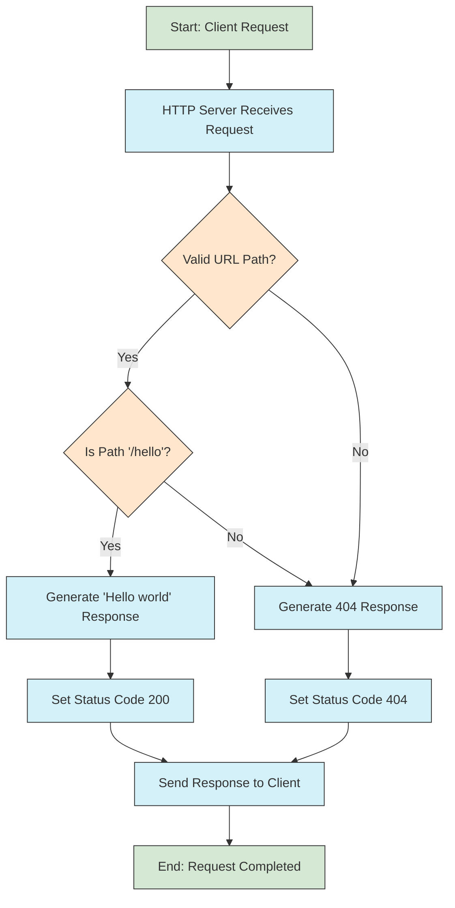
```mermaid
flowchart TD
    A[Start: Client Request] --> B[HTTP Server Receives Request]
    B --> C{Valid URL Path?}
    C -->|Yes| D{Is Path '/hello'?}
    C -->|No| E[Generate 404 Response]
    D -->|Yes| F[Generate 'Hello world' Response]
    D -->|No| E
    F --> G[Set Status Code 200]
    E --> H[Set Status Code 404]
    G --> I[Send Response to Client]
    H --> I
    I --> J[End: Request Completed]
    
    classDef process fill:#d4f1f9,stroke:#333,stroke-width:1px
    classDef decision fill:#ffe6cc,stroke:#333,stroke-width:1px
    classDef endpoint fill:#d5e8d4,stroke:#333,stroke-width:1px
    
    class A,J endpoint
    class B,F,G,E,H,I process
    class C,D decision
```

**Server Lifecycle Workflow**

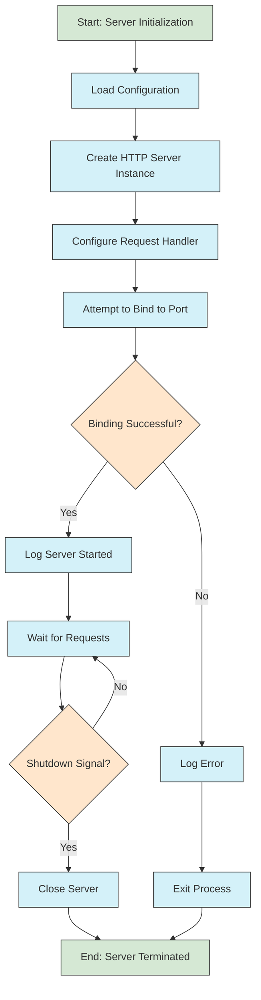
```mermaid
flowchart TD
    A[Start: Server Initialization] --> B[Load Configuration]
    B --> C[Create HTTP Server Instance]
    C --> D[Configure Request Handler]
    D --> E[Attempt to Bind to Port]
    E --> F{Binding Successful?}
    F -->|Yes| G[Log Server Started]
    F -->|No| H[Log Error]
    H --> I[Exit Process]
    G --> J[Wait for Requests]
    J --> K{Shutdown Signal?}
    K -->|No| J
    K -->|Yes| L[Close Server]
    L --> M[End: Server Terminated]
    I --> M
    
    classDef process fill:#d4f1f9,stroke:#333,stroke-width:1px
    classDef decision fill:#ffe6cc,stroke:#333,stroke-width:1px
    classDef endpoint fill:#d5e8d4,stroke:#333,stroke-width:1px
    
    class A,M endpoint
    class B,C,D,E,G,H,I,J,L process
    class F,K decision
```

#### 4.1.2 Integration Workflows

**Client-Server Interaction Flow**

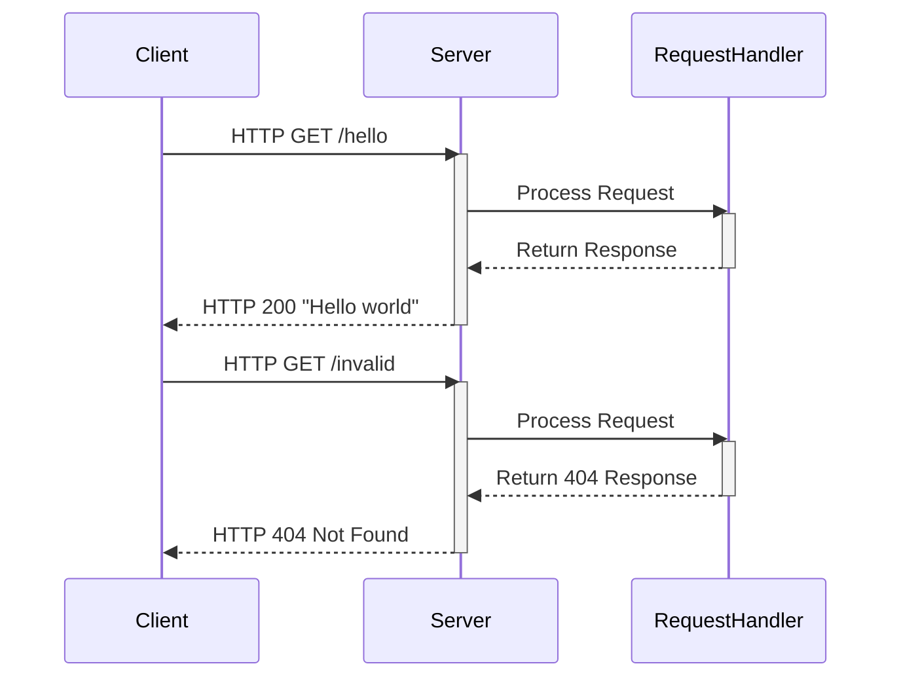
```mermaid
sequenceDiagram
    participant Client
    participant Server
    participant RequestHandler
    
    Client->>Server: HTTP GET /hello
    activate Server
    Server->>RequestHandler: Process Request
    activate RequestHandler
    RequestHandler-->>Server: Return Response
    deactivate RequestHandler
    Server-->>Client: HTTP 200 "Hello world"
    deactivate Server
    
    Client->>Server: HTTP GET /invalid
    activate Server
    Server->>RequestHandler: Process Request
    activate RequestHandler
    RequestHandler-->>Server: Return 404 Response
    deactivate RequestHandler
    Server-->>Client: HTTP 404 Not Found
    deactivate Server
```

### 4.2 FLOWCHART REQUIREMENTS

#### 4.2.1 Detailed Request Processing Workflow

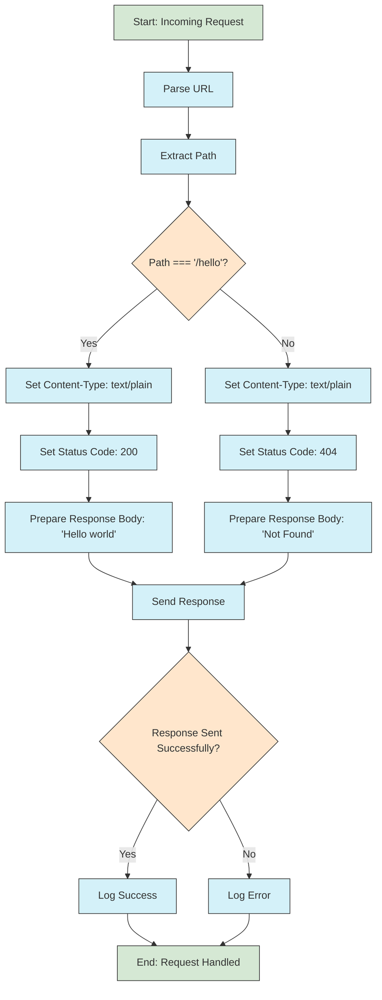
```mermaid
flowchart TD
    A[Start: Incoming Request] --> B[Parse URL]
    B --> C[Extract Path]
    C --> D{Path === '/hello'?}
    
    D -->|Yes| E[Set Content-Type: text/plain]
    D -->|No| F[Set Content-Type: text/plain]
    
    E --> G[Set Status Code: 200]
    F --> H[Set Status Code: 404]
    
    G --> I[Prepare Response Body: 'Hello world']
    H --> J[Prepare Response Body: 'Not Found']
    
    I --> K[Send Response]
    J --> K
    
    K --> L{Response Sent Successfully?}
    L -->|Yes| M[Log Success]
    L -->|No| N[Log Error]
    
    M --> O[End: Request Handled]
    N --> O
    
    classDef process fill:#d4f1f9,stroke:#333,stroke-width:1px
    classDef decision fill:#ffe6cc,stroke:#333,stroke-width:1px
    classDef endpoint fill:#d5e8d4,stroke:#333,stroke-width:1px
    
    class A,O endpoint
    class B,C,E,F,G,H,I,J,K,M,N process
    class D,L decision
```

#### 4.2.2 Validation Rules

**Request Validation Flow**

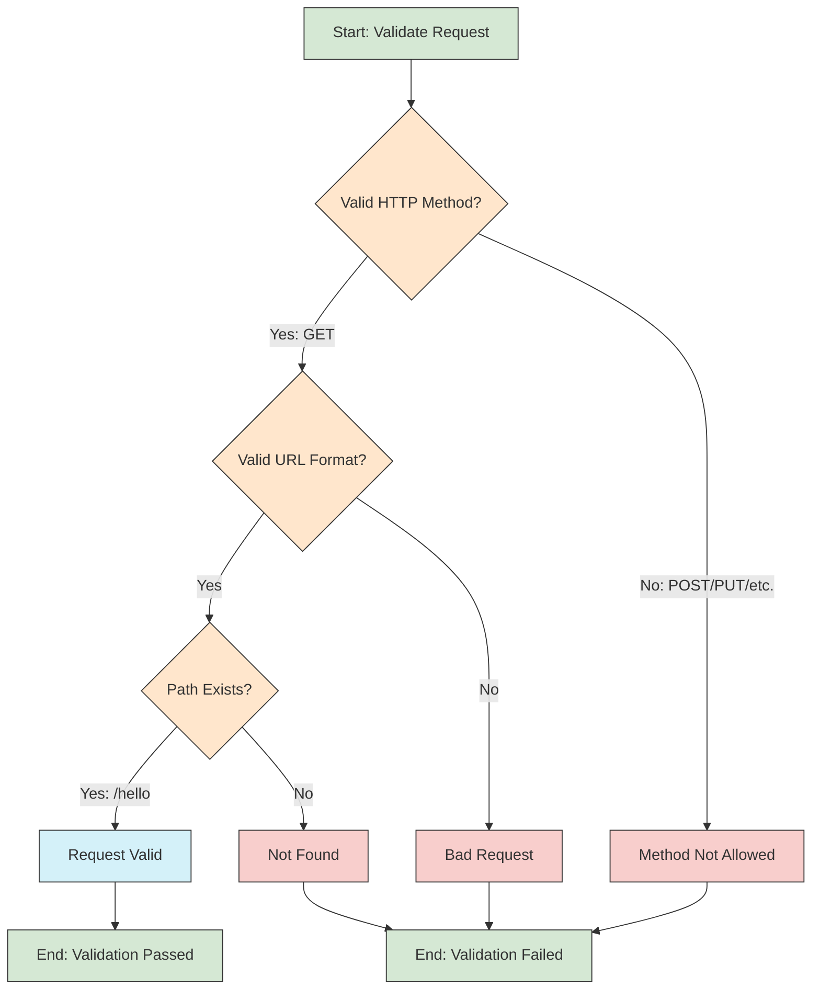
```mermaid
flowchart TD
    A[Start: Validate Request] --> B{Valid HTTP Method?}
    B -->|Yes: GET| C{Valid URL Format?}
    B -->|No: POST/PUT/etc.| D[Method Not Allowed]
    
    C -->|Yes| E{Path Exists?}
    C -->|No| F[Bad Request]
    
    E -->|Yes: /hello| G[Request Valid]
    E -->|No| H[Not Found]
    
    D --> I[End: Validation Failed]
    F --> I
    H --> I
    G --> J[End: Validation Passed]
    
    classDef process fill:#d4f1f9,stroke:#333,stroke-width:1px
    classDef decision fill:#ffe6cc,stroke:#333,stroke-width:1px
    classDef endpoint fill:#d5e8d4,stroke:#333,stroke-width:1px
    classDef failure fill:#f8cecc,stroke:#333,stroke-width:1px
    
    class A endpoint
    class G process
    class B,C,E decision
    class D,F,H failure
    class I,J endpoint
```

### 4.3 TECHNICAL IMPLEMENTATION

#### 4.3.1 State Management

**Server State Transition Diagram**

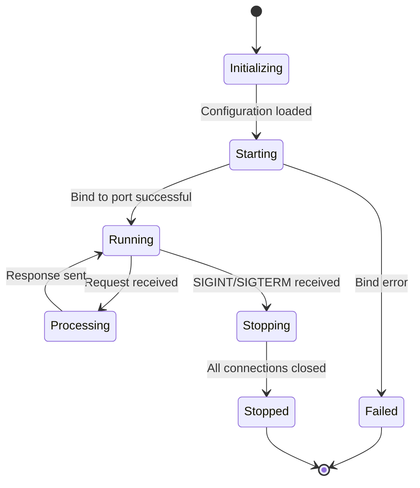
```mermaid
stateDiagram-v2
    [*] --> Initializing
    Initializing --> Starting: Configuration loaded
    Starting --> Running: Bind to port successful
    Starting --> Failed: Bind error
    
    Running --> Processing: Request received
    Processing --> Running: Response sent
    
    Running --> Stopping: SIGINT/SIGTERM received
    Stopping --> Stopped: All connections closed
    Failed --> [*]
    Stopped --> [*]
```

#### 4.3.2 Error Handling

**Error Handling Flowchart**

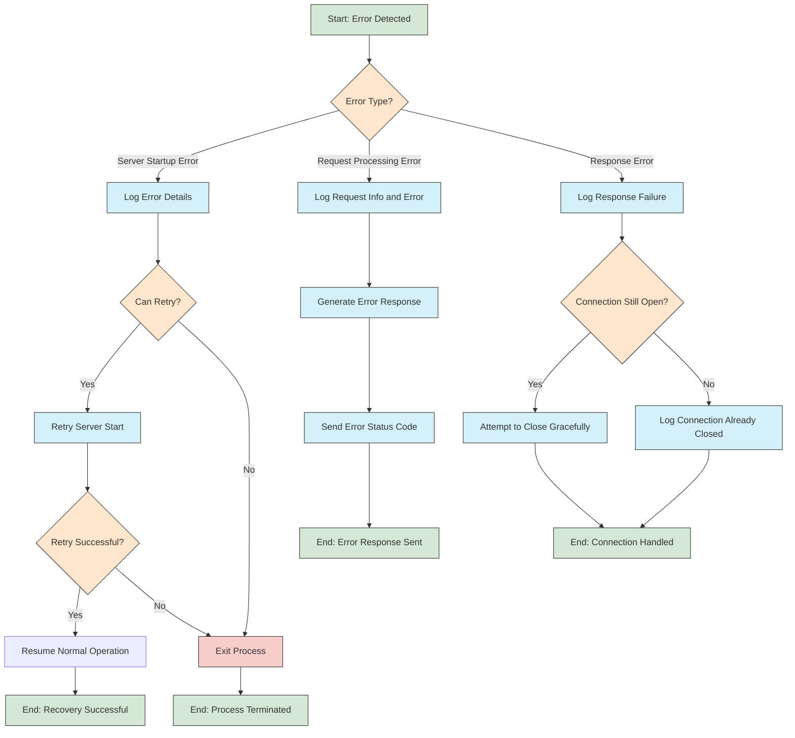
```mermaid
flowchart TD
    A[Start: Error Detected] --> B{Error Type?}
    
    B -->|Server Startup Error| C[Log Error Details]
    B -->|Request Processing Error| D[Log Request Info and Error]
    B -->|Response Error| E[Log Response Failure]
    
    C --> F{Can Retry?}
    F -->|Yes| G[Retry Server Start]
    F -->|No| H[Exit Process]
    
    D --> I[Generate Error Response]
    I --> J[Send Error Status Code]
    
    E --> K{Connection Still Open?}
    K -->|Yes| L[Attempt to Close Gracefully]
    K -->|No| M[Log Connection Already Closed]
    
    G --> N{Retry Successful?}
    N -->|Yes| O[Resume Normal Operation]
    N -->|No| H
    
    H --> P[End: Process Terminated]
    J --> Q[End: Error Response Sent]
    L --> R[End: Connection Handled]
    M --> R
    O --> S[End: Recovery Successful]
    
    classDef process fill:#d4f1f9,stroke:#333,stroke-width:1px
    classDef decision fill:#ffe6cc,stroke:#333,stroke-width:1px
    classDef endpoint fill:#d5e8d4,stroke:#333,stroke-width:1px
    classDef error fill:#f8cecc,stroke:#333,stroke-width:1px
    
    class A endpoint
    class C,D,E,G,I,J,L,M process
    class B,F,K,N decision
    class H error
    class P,Q,R,S endpoint
```

### 4.4 SYSTEM INTERACTION DIAGRAM

**Complete System Workflow with Actors**

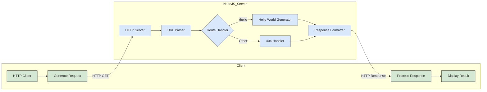
```mermaid
flowchart LR
    subgraph Client
        A[HTTP Client] --> B[Generate Request]
        H[Process Response] --> I[Display Result]
    end
    
    subgraph NodeJS_Server
        C[HTTP Server] --> D[URL Parser]
        D --> E{Route Handler}
        E -->|/hello| F[Hello World Generator]
        E -->|Other| G[404 Handler]
        F --> J[Response Formatter]
        G --> J
    end
    
    B -->|HTTP GET| C
    J -->|HTTP Response| H
    
    classDef client fill:#d5e8d4,stroke:#333,stroke-width:1px
    classDef server fill:#dae8fc,stroke:#333,stroke-width:1px
    classDef process fill:#fff2cc,stroke:#333,stroke-width:1px
    
    class A,B,H,I client
    class C,D,E,F,G,J server
```

**Timing and SLA Considerations**

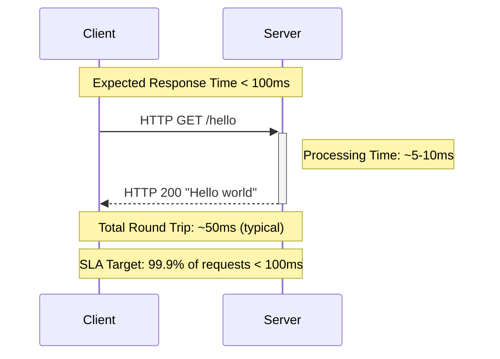
```mermaid
sequenceDiagram
    participant Client
    participant Server
    
    Note over Client,Server: Expected Response Time < 100ms
    
    Client->>+Server: HTTP GET /hello
    Note right of Server: Processing Time: ~5-10ms
    Server-->>-Client: HTTP 200 "Hello world"
    
    Note over Client,Server: Total Round Trip: ~50ms (typical)
    Note over Client,Server: SLA Target: 99.9% of requests < 100ms
```

### 5.1 HIGH-LEVEL ARCHITECTURE

#### 5.1.1 System Overview

The Node.js Hello World service follows a simple, monolithic architecture pattern that emphasizes minimalism and clarity. The system is designed as a standalone HTTP server with the following architectural characteristics:

- **Architectural Style**: Single-tier, monolithic web service using Node.js core modules
- **Key Architectural Principles**:
  - Simplicity: Minimal dependencies and straightforward implementation
  - Modularity: Clear separation of server setup and request handling
  - Statelessness: No session or state management between requests
  - Single Responsibility: Each component has a clear, focused purpose

- **System Boundaries**:
  - The system operates as a self-contained HTTP server
  - External boundary is the HTTP interface exposed to clients
  - No integration with external systems, databases, or services

- **Major Interfaces**:
  - HTTP REST endpoint at `/hello` path
  - Command-line interface for server startup and shutdown

#### 5.1.2 Core Components Table

| Component Name | Primary Responsibility | Key Dependencies | Integration Points | Critical Considerations |
|----------------|------------------------|------------------|-------------------|------------------------|
| HTTP Server | Listen for and accept incoming HTTP connections | Node.js core HTTP module | Client HTTP requests | Port binding, error handling |
| Request Router | Parse incoming URLs and route to appropriate handler | URL parsing utilities | HTTP Server | Path matching logic, error cases |
| Hello Handler | Process requests to `/hello` endpoint and generate responses | None | Request Router | Response format, status codes |
| Configuration Manager | Manage server settings (port, host) | Environment variables | HTTP Server | Default values, validation |

#### 5.1.3 Data Flow Description

The data flow in this system is straightforward and unidirectional:

1. **Client Request Flow**: External HTTP clients send GET requests to the server's `/hello` endpoint.

2. **Request Processing Flow**: The HTTP Server component receives the request and passes it to the Request Router, which examines the URL path. If the path matches `/hello`, the request is forwarded to the Hello Handler. Otherwise, a 404 response is generated.

3. **Response Generation Flow**: The Hello Handler constructs a simple text response containing "Hello world" with appropriate HTTP headers and status code (200 OK). This response is then sent back through the HTTP Server to the client.

4. **Error Flow**: If errors occur during request processing, appropriate error responses are generated with corresponding HTTP status codes and returned to the client.

No data persistence or caching is required in this system, as all responses are generated dynamically without state. The system does not transform data between components, as the data flow is minimal and the response is static.

#### 5.1.4 External Integration Points

For this minimal Hello World service, there are no external systems to integrate with. The only external interaction is with HTTP clients.

| System Name | Integration Type | Data Exchange Pattern | Protocol/Format | SLA Requirements |
|-------------|------------------|------------------------|----------------|------------------|
| HTTP Clients | Synchronous Request/Response | Request-Reply | HTTP/Plain Text | Response time < 100ms |

### 5.2 COMPONENT DETAILS

#### 5.2.1 HTTP Server Component

- **Purpose and Responsibilities**:
  - Create and initialize the HTTP server instance
  - Bind to configured network interface and port
  - Accept incoming HTTP connections
  - Forward requests to the Request Router
  - Send responses back to clients
  - Handle server lifecycle events (start, stop, error)

- **Technologies and Frameworks**:
  - Node.js core `http` module
  - No external frameworks or libraries

- **Key Interfaces**:
  - `createServer()`: Creates HTTP server instance
  - `listen()`: Binds server to port and starts listening
  - `close()`: Gracefully shuts down the server

- **Data Persistence Requirements**: None

- **Scaling Considerations**:
  - Single-process model sufficient for demonstration purposes
  - No clustering or load balancing required

#### 5.2.2 Request Router Component

- **Purpose and Responsibilities**:
  - Parse incoming request URLs
  - Match URL paths against defined routes
  - Dispatch requests to appropriate handlers
  - Generate 404 responses for undefined routes

- **Technologies and Frameworks**:
  - Node.js core `url` module
  - Custom routing logic

- **Key Interfaces**:
  - `handleRequest(req, res)`: Main entry point for processing requests

- **Data Persistence Requirements**: None

- **Scaling Considerations**: None

#### 5.2.3 Hello Handler Component

- **Purpose and Responsibilities**:
  - Process requests to the `/hello` endpoint
  - Generate "Hello world" text responses
  - Set appropriate HTTP headers and status codes

- **Technologies and Frameworks**:
  - Pure JavaScript
  - Node.js HTTP response methods

- **Key Interfaces**:
  - `handleHello(req, res)`: Processes `/hello` requests

- **Data Persistence Requirements**: None

- **Scaling Considerations**: None

#### 5.2.4 Configuration Manager Component

- **Purpose and Responsibilities**:
  - Load and validate server configuration
  - Provide default values when configuration is missing
  - Make configuration available to other components

- **Technologies and Frameworks**:
  - Node.js environment variables
  - JavaScript object literals

- **Key Interfaces**:
  - `getConfig()`: Returns server configuration

- **Data Persistence Requirements**: None

- **Scaling Considerations**: None

#### 5.2.5 Component Interaction Diagram

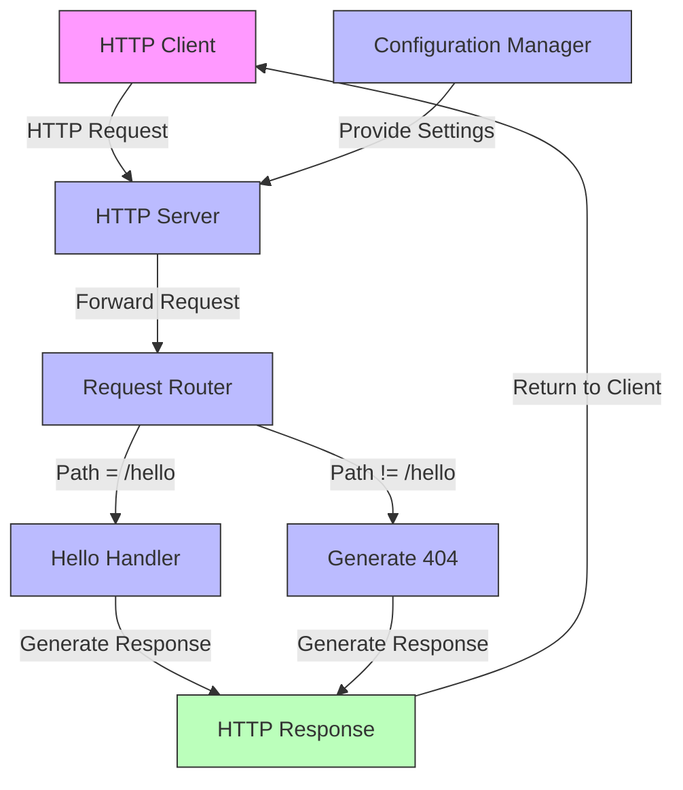
```mermaid
graph TD
    A[HTTP Client] -->|HTTP Request| B[HTTP Server]
    B -->|Forward Request| C[Request Router]
    C -->|Path = /hello| D[Hello Handler]
    C -->|Path != /hello| E[Generate 404]
    D -->|Generate Response| F[HTTP Response]
    E -->|Generate Response| F
    F -->|Return to Client| A
    G[Configuration Manager] -->|Provide Settings| B
    
    classDef external fill:#f9f,stroke:#333,stroke-width:1px
    classDef component fill:#bbf,stroke:#333,stroke-width:1px
    classDef response fill:#bfb,stroke:#333,stroke-width:1px
    
    class A external
    class B,C,D,E,G component
    class F response
```

#### 5.2.6 Request Processing Sequence Diagram

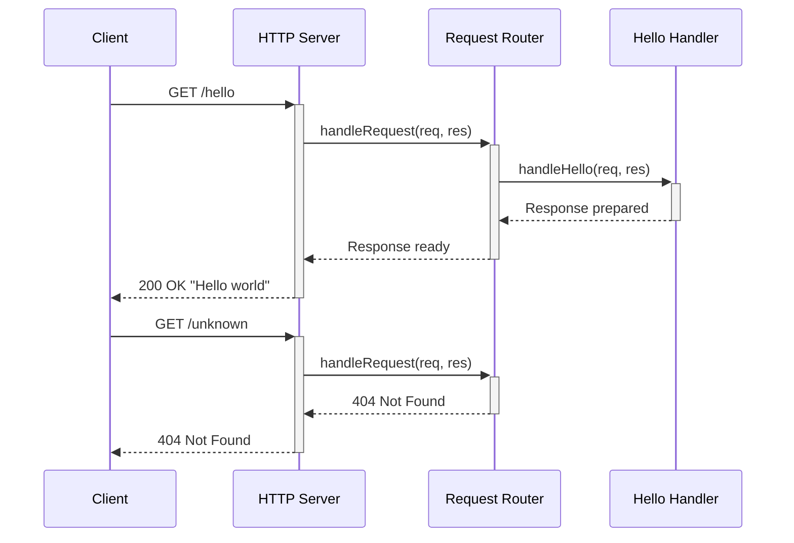
```mermaid
sequenceDiagram
    participant Client
    participant Server as HTTP Server
    participant Router as Request Router
    participant Handler as Hello Handler
    
    Client->>+Server: GET /hello
    Server->>+Router: handleRequest(req, res)
    Router->>+Handler: handleHello(req, res)
    Handler-->>-Router: Response prepared
    Router-->>-Server: Response ready
    Server-->>-Client: 200 OK "Hello world"
    
    Client->>+Server: GET /unknown
    Server->>+Router: handleRequest(req, res)
    Router-->>-Server: 404 Not Found
    Server-->>-Client: 404 Not Found
```

### 5.3 TECHNICAL DECISIONS

#### 5.3.1 Architecture Style Decisions

| Decision | Options Considered | Selected Approach | Rationale |
|----------|-------------------|-------------------|-----------|
| Server Architecture | Express.js Framework, Node.js HTTP, Fastify | Node.js Core HTTP | Minimizes dependencies, demonstrates core Node.js capabilities, simplifies learning curve |
| Component Structure | Microservices, Monolith, Layered | Simple Monolith | Appropriate for small scope, reduces complexity, easier to understand |
| Request Handling | Middleware Chain, Direct Routing, Event-based | Direct Routing | Simplest approach for single endpoint, clear control flow |

The monolithic architecture with direct routing was selected because:
- It aligns with the educational purpose of the application
- It demonstrates Node.js fundamentals without framework abstractions
- It minimizes complexity for a single-endpoint service
- It requires no build process or complex deployment

#### 5.3.2 Communication Pattern Choices

| Pattern | Use Case | Implementation | Justification |
|---------|----------|----------------|---------------|
| Synchronous Request/Response | Client-Server Communication | HTTP GET/Response | Standard web protocol, simple to implement, appropriate for stateless service |
| Direct Function Calls | Inter-component Communication | JavaScript Function Calls | Simplest approach for in-process communication, no need for complex messaging |

#### 5.3.3 Architecture Decision Record: Core HTTP vs. Express.js

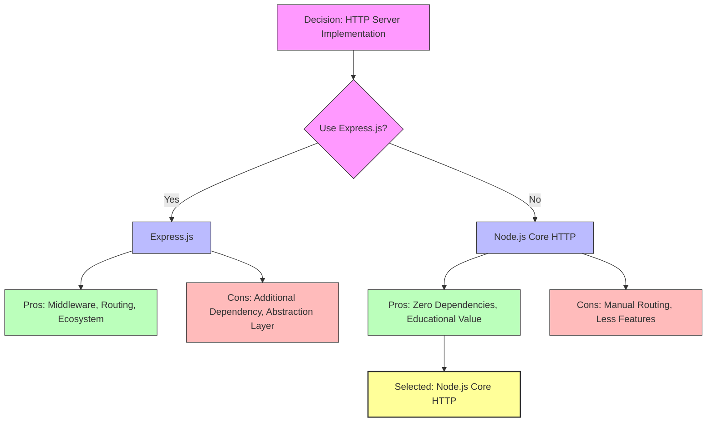
```mermaid
graph TD
    A[Decision: HTTP Server Implementation] --> B{Use Express.js?}
    B -->|Yes| C[Express.js]
    B -->|No| D[Node.js Core HTTP]
    
    C --> E[Pros: Middleware, Routing, Ecosystem]
    C --> F[Cons: Additional Dependency, Abstraction Layer]
    
    D --> G[Pros: Zero Dependencies, Educational Value]
    D --> H[Cons: Manual Routing, Less Features]
    
    G --> I[Selected: Node.js Core HTTP]
    
    classDef decision fill:#f9f,stroke:#333,stroke-width:1px
    classDef option fill:#bbf,stroke:#333,stroke-width:1px
    classDef pro fill:#bfb,stroke:#333,stroke-width:1px
    classDef con fill:#fbb,stroke:#333,stroke-width:1px
    classDef selected fill:#ff9,stroke:#333,stroke-width:2px
    
    class A decision
    class B decision
    class C,D option
    class E,G pro
    class F,H con
    class I selected
```

### 5.4 CROSS-CUTTING CONCERNS

#### 5.4.1 Error Handling Patterns

The error handling strategy for this simple service focuses on robustness and clear feedback:

- **Server Startup Errors**: Caught and logged to console with descriptive messages, process exits with non-zero code
- **Request Processing Errors**: Caught and responded to with appropriate HTTP status codes
- **Uncaught Exceptions**: Global handler to prevent server crash, logs error details

| Error Type | Handling Approach | Response to Client | System Action |
|------------|-------------------|-------------------|---------------|
| Invalid Route | 404 Not Found response | 404 status code with text message | Log request path |
| Server Binding Error | Console error message | No response (server doesn't start) | Exit process |
| Request Processing Error | Catch and handle gracefully | 500 Internal Server Error | Log error details |

#### 5.4.2 Error Handling Flow

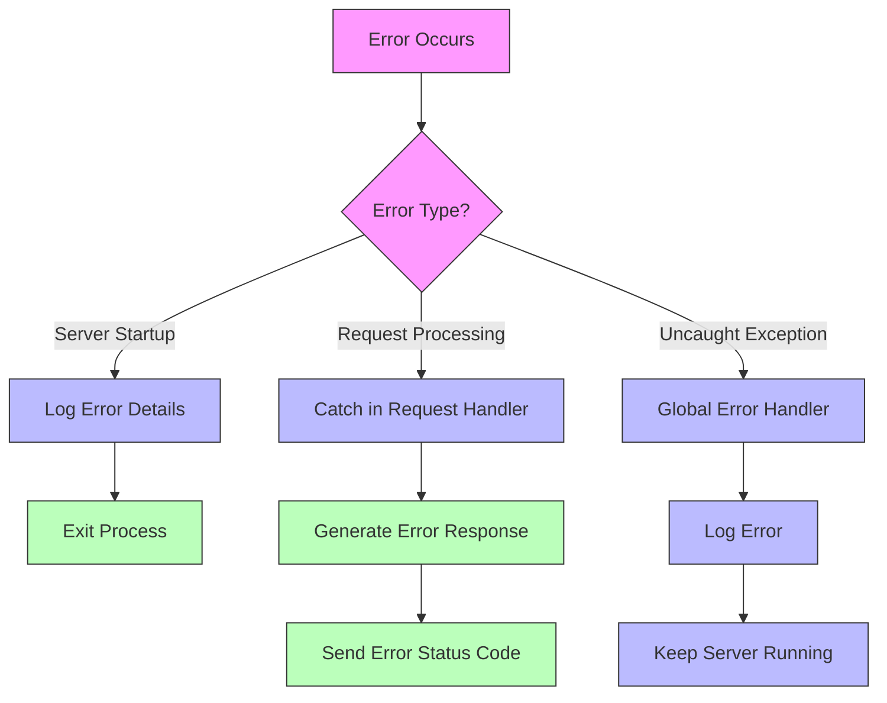
```mermaid
flowchart TD
    A[Error Occurs] --> B{Error Type?}
    
    B -->|Server Startup| C[Log Error Details]
    B -->|Request Processing| D[Catch in Request Handler]
    B -->|Uncaught Exception| E[Global Error Handler]
    
    C --> F[Exit Process]
    D --> G[Generate Error Response]
    E --> H[Log Error]
    H --> I[Keep Server Running]
    
    G --> J[Send Error Status Code]
    
    classDef error fill:#f9f,stroke:#333,stroke-width:1px
    classDef process fill:#bbf,stroke:#333,stroke-width:1px
    classDef response fill:#bfb,stroke:#333,stroke-width:1px
    
    class A,B error
    class C,D,E,H,I process
    class F,G,J response
```

#### 5.4.3 Logging Strategy

For this minimal service, a simple logging approach is sufficient:

- **Console Logging**: Direct output to stdout/stderr
- **Log Levels**: Basic info/error distinction
- **Log Content**: Server events, request details, error information

| Event Type | Log Level | Information Included |
|------------|-----------|----------------------|
| Server Start | INFO | Port, host, timestamp |
| Request Received | INFO | Method, path, timestamp |
| Request Completed | INFO | Method, path, status code, response time |
| Error | ERROR | Error message, stack trace, context |

#### 5.4.4 Performance Requirements

The performance requirements for this simple service are modest:

- **Response Time**: < 100ms for all requests
- **Throughput**: No specific requirement (educational purpose)
- **Resource Usage**: Minimal memory and CPU footprint

No specific monitoring, authentication, or disaster recovery procedures are required for this educational Hello World service, as these would add unnecessary complexity to what is intended as a simple learning example.

## 6. SYSTEM COMPONENTS DESIGN

### 6.1 COMPONENT ARCHITECTURE

#### 6.1.1 Component Diagram

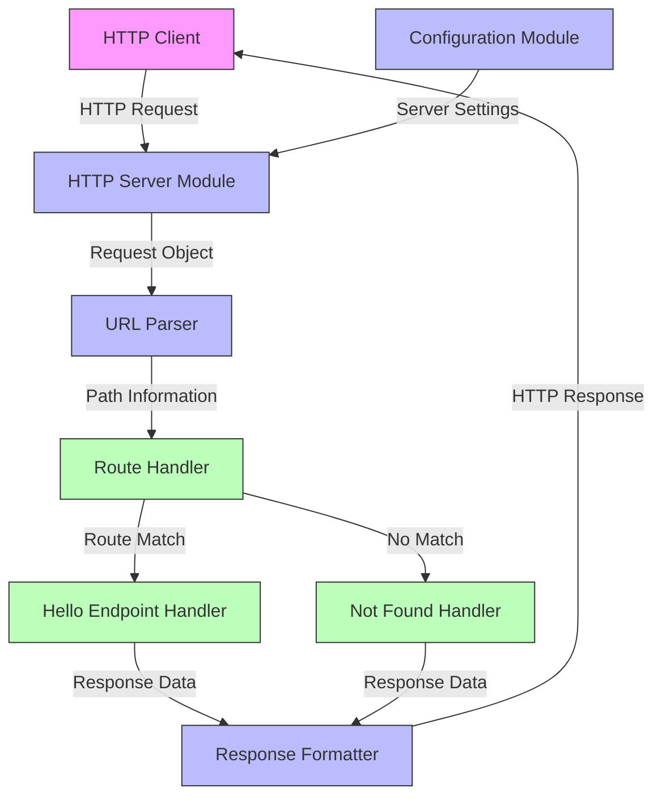
```mermaid
graph TD
    A[HTTP Client] -->|HTTP Request| B[HTTP Server Module]
    B -->|Request Object| C[URL Parser]
    C -->|Path Information| D[Route Handler]
    D -->|Route Match| E[Hello Endpoint Handler]
    D -->|No Match| F[Not Found Handler]
    E -->|Response Data| G[Response Formatter]
    F -->|Response Data| G
    G -->|HTTP Response| A
    H[Configuration Module] -->|Server Settings| B
    
    classDef external fill:#f9f,stroke:#333,stroke-width:1px
    classDef core fill:#bbf,stroke:#333,stroke-width:1px
    classDef handler fill:#bfb,stroke:#333,stroke-width:1px
    
    class A external
    class B,C,G,H core
    class D,E,F handler
```

#### 6.1.2 Component Responsibilities

| Component | Responsibility | Interfaces | Dependencies |
|-----------|----------------|------------|--------------|
| HTTP Server Module | Create and manage HTTP server lifecycle | `createServer()`, `listen()`, `close()` | Node.js http module |
| URL Parser | Extract and parse URL paths from requests | `parseUrl(req)` | Node.js url module |
| Route Handler | Match request paths to appropriate handlers | `routeRequest(req, res)` | URL Parser |
| Hello Endpoint Handler | Process requests to `/hello` endpoint | `handleHello(req, res)` | None |
| Not Found Handler | Generate 404 responses for unknown routes | `handleNotFound(req, res)` | None |
| Response Formatter | Set appropriate headers and format response | `formatResponse(res, statusCode, content)` | None |
| Configuration Module | Manage server configuration settings | `getConfig()` | Node.js process.env |

### 6.2 MODULE DESIGN

#### 6.2.1 Module Structure

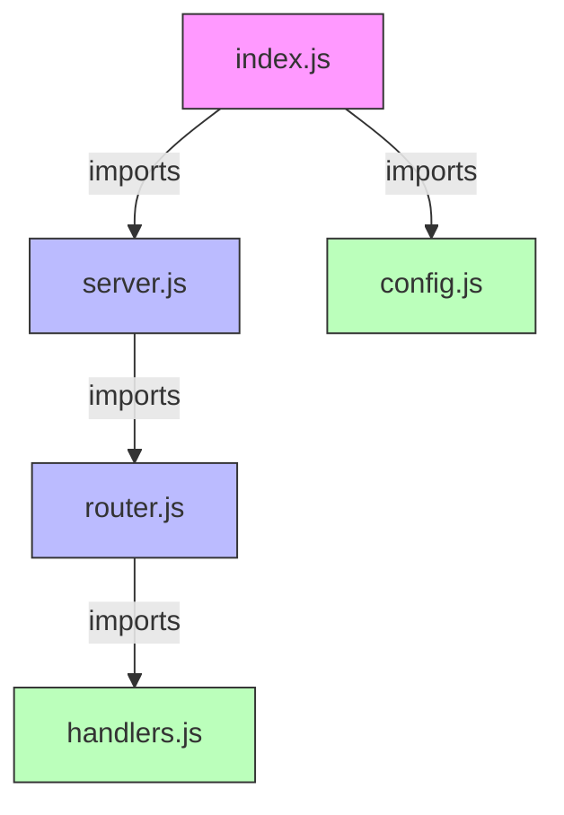
```mermaid
graph TD
    A[index.js] -->|imports| B[server.js]
    A -->|imports| C[config.js]
    B -->|imports| D[router.js]
    D -->|imports| E[handlers.js]
    
    classDef entry fill:#f9f,stroke:#333,stroke-width:1px
    classDef core fill:#bbf,stroke:#333,stroke-width:1px
    classDef util fill:#bfb,stroke:#333,stroke-width:1px
    
    class A entry
    class B,D core
    class C,E util
```

#### 6.2.2 Module Descriptions

| Module | Purpose | Key Functions | Exports |
|--------|---------|--------------|---------|
| index.js | Application entry point | Initialize and start server | None (executable) |
| server.js | HTTP server implementation | `createServer()`, `startServer()`, `stopServer()` | Server object and functions |
| config.js | Configuration management | `getConfig()`, `validateConfig()` | Configuration object |
| router.js | Request routing logic | `routeRequest()` | Router function |
| handlers.js | Request handlers | `handleHello()`, `handleNotFound()` | Handler functions |

### 6.3 INTERFACE DESIGN

#### 6.3.1 API Endpoints

| Endpoint | Method | Description | Request Format | Response Format | Status Codes |
|----------|--------|-------------|----------------|-----------------|-------------|
| `/hello` | GET | Returns "Hello world" text | No parameters | Plain text | 200 OK |
| `/*` (any other path) | GET | Returns not found error | No parameters | Plain text | 404 Not Found |

#### 6.3.2 Internal Interfaces

| Interface | Type | Description | Parameters | Return Value |
|-----------|------|-------------|------------|--------------|
| `createServer` | Function | Creates HTTP server instance | None | Server object |
| `startServer` | Function | Starts HTTP server | `port`, `host` | Promise<void> |
| `stopServer` | Function | Stops HTTP server | None | Promise<void> |
| `routeRequest` | Function | Routes HTTP requests | `req`, `res` | void |
| `handleHello` | Function | Handles `/hello` requests | `req`, `res` | void |
| `handleNotFound` | Function | Handles unknown routes | `req`, `res` | void |
| `getConfig` | Function | Retrieves configuration | None | Config object |

### 6.4 DATA DESIGN

#### 6.4.1 Data Structures

| Structure | Purpose | Properties | Format |
|-----------|---------|------------|--------|
| Config | Server configuration | `port`, `host` | JavaScript object |
| Request | HTTP request information | Standard Node.js request object | Node.js http.IncomingMessage |
| Response | HTTP response | Standard Node.js response object | Node.js http.ServerResponse |

#### 6.4.2 Data Flow

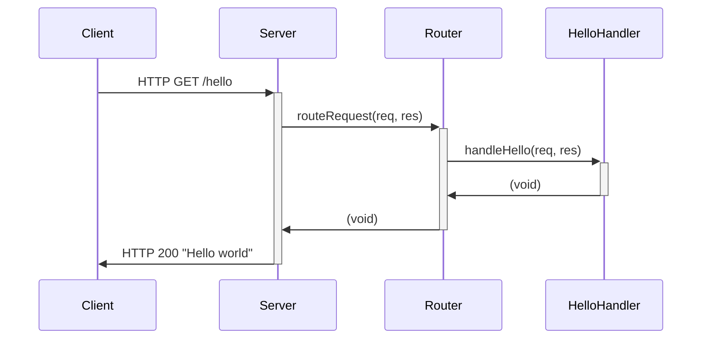
```mermaid
sequenceDiagram
    participant Client
    participant Server
    participant Router
    participant HelloHandler
    
    Client->>+Server: HTTP GET /hello
    Server->>+Router: routeRequest(req, res)
    Router->>+HelloHandler: handleHello(req, res)
    HelloHandler->>-Router: (void)
    Router->>-Server: (void)
    Server->>-Client: HTTP 200 "Hello world"
```

### 6.5 ERROR HANDLING DESIGN

#### 6.5.1 Error Types

| Error Type | Description | Handling Strategy |
|------------|-------------|-------------------|
| Server Startup Error | Error when starting HTTP server | Log error and exit process |
| Route Not Found | Request to undefined route | Return 404 status code |
| Request Processing Error | Error during request handling | Return 500 status code |
| Server Shutdown Error | Error when stopping server | Log error and force exit |

#### 6.5.2 Error Handling Flow

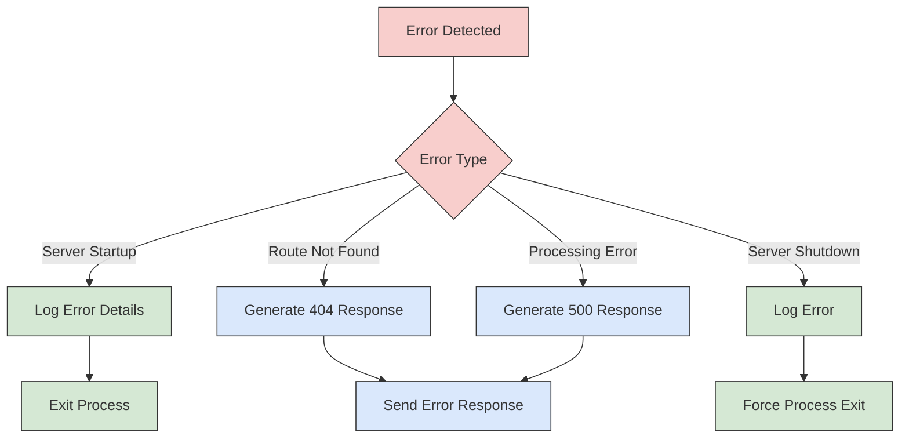
```mermaid
flowchart TD
    A[Error Detected] --> B{Error Type}
    
    B -->|Server Startup| C[Log Error Details]
    B -->|Route Not Found| D[Generate 404 Response]
    B -->|Processing Error| E[Generate 500 Response]
    B -->|Server Shutdown| F[Log Error]
    
    C --> G[Exit Process]
    D --> H[Send Error Response]
    E --> H
    F --> I[Force Process Exit]
    
    classDef error fill:#f8cecc,stroke:#333,stroke-width:1px
    classDef process fill:#d5e8d4,stroke:#333,stroke-width:1px
    classDef response fill:#dae8fc,stroke:#333,stroke-width:1px
    
    class A,B error
    class C,F,G,I process
    class D,E,H response
```

### 6.6 CONFIGURATION DESIGN

#### 6.6.1 Configuration Parameters

| Parameter | Description | Default Value | Environment Variable |
|-----------|-------------|---------------|---------------------|
| Port | HTTP server port | 3000 | PORT |
| Host | HTTP server host | '127.0.0.1' | HOST |

#### 6.6.2 Configuration Loading Process

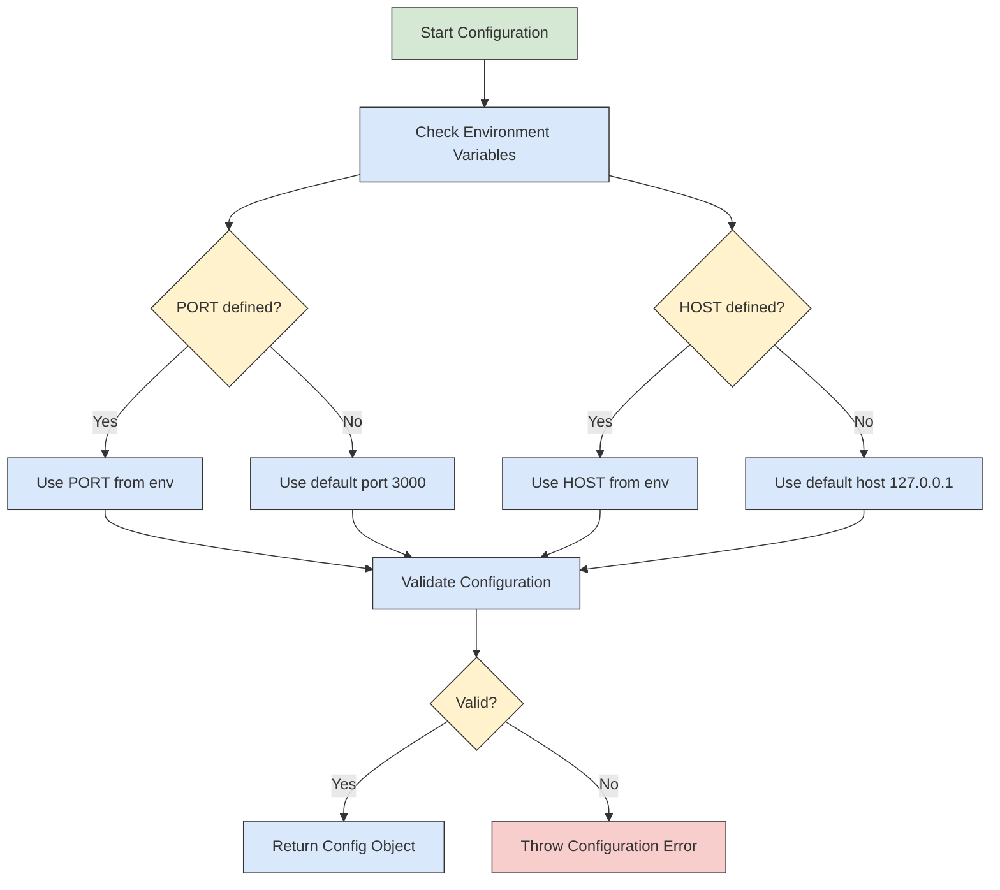
```mermaid
flowchart TD
    A[Start Configuration] --> B[Check Environment Variables]
    B --> C{PORT defined?}
    C -->|Yes| D[Use PORT from env]
    C -->|No| E[Use default port 3000]
    
    B --> F{HOST defined?}
    F -->|Yes| G[Use HOST from env]
    F -->|No| H[Use default host 127.0.0.1]
    
    D --> I[Validate Configuration]
    E --> I
    G --> I
    H --> I
    
    I --> J{Valid?}
    J -->|Yes| K[Return Config Object]
    J -->|No| L[Throw Configuration Error]
    
    classDef start fill:#d5e8d4,stroke:#333,stroke-width:1px
    classDef process fill:#dae8fc,stroke:#333,stroke-width:1px
    classDef decision fill:#fff2cc,stroke:#333,stroke-width:1px
    classDef error fill:#f8cecc,stroke:#333,stroke-width:1px
    
    class A start
    class B,D,E,G,H,I,K process
    class C,F,J decision
    class L error
```

### 6.7 LOGGING DESIGN

#### 6.7.1 Logging Events

| Event | Log Level | Information Included |
|-------|-----------|----------------------|
| Server Start | INFO | Timestamp, port, host |
| Server Stop | INFO | Timestamp, shutdown reason |
| Request Received | DEBUG | Timestamp, method, path |
| Request Completed | INFO | Timestamp, method, path, status code, duration |
| Error | ERROR | Timestamp, error message, stack trace |

#### 6.7.2 Logging Implementation

For this simple application, logging will use console methods:
- `console.log()` for INFO level
- `console.debug()` for DEBUG level
- `console.error()` for ERROR level

This approach keeps the implementation simple while providing necessary visibility into application behavior.

### 6.8 TESTING APPROACH

#### 6.8.1 Test Types

| Test Type | Purpose | Tools | Coverage |
|-----------|---------|-------|----------|
| Unit Tests | Test individual functions | Jest | All modules and functions |
| Integration Tests | Test component interactions | Supertest | HTTP server and routing |
| End-to-End Tests | Test complete request flow | Axios/Fetch | `/hello` endpoint |

#### 6.8.2 Test Cases

| Test ID | Description | Expected Result |
|---------|-------------|----------------|
| UT-001 | Test server creation | Server object created successfully |
| UT-002 | Test route handler for `/hello` | Returns correct response |
| UT-003 | Test route handler for unknown path | Returns 404 response |
| UT-004 | Test configuration loading | Config object with correct values |
| IT-001 | Test server startup | Server starts and listens on port |
| IT-002 | Test server shutdown | Server stops gracefully |
| E2E-001 | Test GET request to `/hello` | 200 response with "Hello world" |
| E2E-002 | Test GET request to `/unknown` | 404 response |

### 6.1 CORE SERVICES ARCHITECTURE

Core Services Architecture is not applicable for this system in its traditional distributed form. This Node.js Hello World application is intentionally designed as a simple, monolithic HTTP server with a single endpoint. The application does not require microservices, distributed architecture, or distinct service components for the following reasons:

1. **Minimal Functional Requirements**: The application only needs to serve a single endpoint (`/hello`) with static content.
2. **Educational Purpose**: The primary goal is to demonstrate basic Node.js HTTP server concepts with minimal complexity.
3. **No Complex Business Logic**: There are no distinct business domains that would benefit from service separation.
4. **No Specialized Scaling Needs**: Different components don't have varying resource requirements that would justify separation.

#### 6.1.1 SIMPLIFIED SERVICE ARCHITECTURE

While not implementing a microservices architecture, the application does follow good design principles with clear component separation:

| Component | Responsibility | Implementation Approach |
|-----------|----------------|-------------------------|
| HTTP Server | Handle network connections | Node.js core HTTP module |
| Request Router | Direct requests to handlers | Simple path-based routing |
| Response Handler | Generate HTTP responses | Direct function calls |
| Configuration | Manage server settings | Environment variables |

```mermaid
graph TD
    A[Client] -->|HTTP Request| B[HTTP Server]
    B -->|Request Object| C[Request Router]
    C -->|Route Match| D[Hello Handler]
    C -->|No Match| E[404 Handler]
    D -->|Response Data| F[Response Formatter]
    E -->|Response Data| F
    F -->|HTTP Response| A
    G[Configuration] -->|Settings| B

    classDef external fill:#f9f,stroke:#333,stroke-width:1px
    classDef component fill:#bbf,stroke:#333,stroke-width:1px
    
    class A external
    class B,C,D,E,F,G component
```

#### 6.1.2 SCALABILITY CONSIDERATIONS

Although the application doesn't implement distributed scalability patterns, it can be scaled using simpler approaches if needed:

| Scaling Approach | Implementation Method | When to Consider |
|------------------|------------------------|------------------|
| Process-based | Node.js Cluster module | Medium traffic, multi-core systems |
| Container-based | Docker with replicas | Higher traffic, containerized environments |
| Load balancer | Nginx/HAProxy frontend | Production deployments with reliability needs |

```mermaid
graph TD
    A[Load Balancer] -->|Request| B[Node.js Instance 1]
    A -->|Request| C[Node.js Instance 2]
    A -->|Request| D[Node.js Instance N]
    
    B -->|Response| E[Client]
    C -->|Response| E
    D -->|Response| E
    
    classDef external fill:#f9f,stroke:#333,stroke-width:1px
    classDef component fill:#bbf,stroke:#333,stroke-width:1px
    
    class A,E external
    class B,C,D component
```

#### 6.1.3 BASIC RESILIENCE PATTERNS

While not implementing complex resilience patterns, the application should include basic error handling:

| Resilience Aspect | Simple Implementation | Purpose |
|-------------------|------------------------|---------|
| Error Handling | Try/catch blocks | Prevent crashes from unhandled exceptions |
| Graceful Shutdown | Signal handlers | Clean termination on SIGINT/SIGTERM |
| Health Endpoint | Optional `/health` route | Enable basic monitoring |

```mermaid
stateDiagram-v2
    [*] --> Running
    Running --> Error: Exception Occurs
    Error --> Running: Error Handled
    Error --> Degraded: Partial Failure
    Running --> ShuttingDown: SIGINT/SIGTERM
    Degraded --> ShuttingDown: SIGINT/SIGTERM
    ShuttingDown --> [*]: Process Exit
```

#### 6.1.4 FUTURE ARCHITECTURE EVOLUTION

If the application needs to evolve beyond its simple requirements, consider these architectural transitions:

| Evolution Stage | Architectural Change | Triggering Factors |
|-----------------|----------------------|-------------------|
| Stage 1 | Add Express.js framework | More complex routing needs |
| Stage 2 | Implement process clustering | Higher traffic requirements |
| Stage 3 | Containerize with Docker | Deployment standardization |
| Stage 4 | Consider microservices | New business domains, team scaling |

This simple architecture provides a solid foundation while allowing for future growth if requirements change.

### 6.2 DATABASE DESIGN

Database Design is not applicable to this system. The Node.js Hello World application with a single `/hello` endpoint that returns "Hello world" does not require any persistent data storage for the following reasons:

1. **Stateless Operation**: The application operates in a completely stateless manner, with no need to persist information between requests.

2. **Static Response**: The endpoint returns a fixed, static response ("Hello world") that doesn't depend on stored data.

3. **No User Data**: The application doesn't collect, process, or store any user information that would require database storage.

4. **No Configuration Storage**: All configuration (port, host) is handled through environment variables or defaults in the application code.

5. **No Transaction Records**: The application doesn't need to record transaction history, logs, or metrics in a database (console logging is sufficient for this simple use case).

6. **No Authentication**: The application doesn't implement user authentication or authorization that would require user records.

7. **No Business Logic**: There's no complex business logic that requires persistent state management.

#### Alternative Approaches for Future Expansion

If the application were to expand beyond its current minimal requirements, these data storage options could be considered:

| Storage Option | Use Case | When to Consider |
|----------------|----------|------------------|
| File-based Logging | Request logging | When basic monitoring and debugging are needed |
| In-memory Cache | Response caching | If dynamic responses are added that benefit from caching |
| NoSQL Document Store | Configuration | If complex configuration management is required |
| Relational Database | User data | If user accounts or persistent transactions are added |

```mermaid
flowchart TD
    A[HTTP Request] --> B[Node.js Server]
    B --> C[Request Handler]
    C --> D[Static Response]
    D --> E[HTTP Response]
    
    classDef request fill:#f9f,stroke:#333,stroke-width:1px
    classDef process fill:#bbf,stroke:#333,stroke-width:1px
    classDef response fill:#bfb,stroke:#333,stroke-width:1px
    
    class A,E request
    class B,C process
    class D response
    
    note[No Database Required]
    style note fill:#fff,stroke:#333,stroke-width:1px,stroke-dasharray: 5 5
```

The current architecture intentionally avoids database dependencies to maintain simplicity, minimize resource requirements, and reduce potential points of failure, which aligns with the educational and demonstrative purpose of the application.

### 6.3 INTEGRATION ARCHITECTURE

Integration Architecture is not applicable for this system in its traditional comprehensive form. The Node.js Hello World application with a single `/hello` endpoint is intentionally designed as a standalone, self-contained service with minimal integration requirements for the following reasons:

1. **Simplified Purpose**: The application serves as an educational example demonstrating basic HTTP server functionality in Node.js.

2. **No External Dependencies**: The application operates independently without requiring connections to databases, message queues, or third-party services.

3. **Stateless Operation**: The endpoint returns a static response without needing to process or transform data from other systems.

4. **No Authentication Requirements**: The public `/hello` endpoint is designed to be freely accessible without authentication or authorization controls.

5. **Minimal API Surface**: With only a single endpoint returning static content, complex API management features like versioning are unnecessary.

However, to provide a complete technical specification, we'll document the minimal integration aspects that are relevant to this system.

#### 6.3.1 SIMPLIFIED API DESIGN

| Aspect | Specification |
|--------|---------------|
| Protocol | HTTP/1.1 |
| Endpoint | `/hello` |
| Method | GET |
| Response Format | Plain text |
| Status Codes | 200 OK, 404 Not Found |

The API design intentionally follows REST principles in their simplest form:
- Resource-oriented URL (`/hello`)
- Appropriate HTTP method (GET for retrieval)
- Stateless operation (no session management)
- Clear response format (plain text)

#### 6.3.2 CLIENT INTEGRATION PATTERN

```mermaid
sequenceDiagram
    participant Client as HTTP Client
    participant Server as Node.js Server
    
    Client->>Server: HTTP GET /hello
    Server->>Server: Process request
    Server-->>Client: HTTP 200 "Hello world"
    
    Client->>Server: HTTP GET /unknown
    Server->>Server: Process request
    Server-->>Client: HTTP 404 Not Found
```

#### 6.3.3 MINIMAL INTEGRATION CONSIDERATIONS

While the system doesn't require complex integration architecture, these basic aspects should be considered:

| Consideration | Implementation Approach |
|---------------|-------------------------|
| Content Type | `text/plain` for simplicity |
| Character Encoding | UTF-8 for universal compatibility |
| Error Format | Plain text error messages |
| CORS Support | Not implemented (educational purpose) |

#### 6.3.4 FUTURE INTEGRATION EXPANSION

If the application were to evolve beyond its current minimal requirements, these integration patterns could be considered:

```mermaid
graph TD
    A[HTTP Client] -->|Request| B[Node.js Hello World]
    
    subgraph "Potential Future Expansion"
        C[API Gateway]
        D[Authentication Service]
        E[Monitoring Service]
    end
    
    B -.->|Logs| E
    C -.->|Route| B
    C -.->|Authenticate| D
    
    classDef current fill:#d5e8d4,stroke:#333,stroke-width:1px
    classDef future fill:#dae8fc,stroke:#333,stroke-width:1px,stroke-dasharray: 5 5
    
    class A,B current
    class C,D,E future
```

#### 6.3.5 CLIENT INTEGRATION EXAMPLES

For documentation completeness, here are examples of how clients might integrate with the service:

| Client Type | Integration Example |
|-------------|---------------------|
| Browser | `fetch('http://localhost:3000/hello').then(res => res.text())` |
| cURL | `curl http://localhost:3000/hello` |
| Node.js | `http.get('http://localhost:3000/hello', res => {...})` |
| Python | `requests.get('http://localhost:3000/hello')` |

The intentional simplicity of this service makes it an ideal integration target for learning and testing HTTP clients, as it requires no special headers, authentication tokens, or complex request formatting.

### 6.4 SECURITY ARCHITECTURE

Detailed Security Architecture is not applicable for this system. The Node.js Hello World application with a single `/hello` endpoint that returns static content is intentionally designed as a minimal demonstration with no authentication, authorization, or sensitive data handling requirements for the following reasons:

1. **Public Access Design**: The `/hello` endpoint is designed to be freely accessible to all clients without authentication or authorization controls.

2. **No Sensitive Data**: The application doesn't collect, process, or return any sensitive or personal information that would require protection.

3. **No User Management**: The application doesn't implement user accounts, roles, or permissions.

4. **Educational Purpose**: The primary goal is to demonstrate basic HTTP server functionality in Node.js with minimal complexity.

#### 6.4.1 STANDARD SECURITY PRACTICES

While comprehensive security architecture is not required, the following standard security practices should be implemented:

| Security Practice | Implementation Approach | Purpose |
|-------------------|-------------------------|---------|
| Input Validation | Validate URL paths | Prevent path traversal attacks |
| Error Handling | Avoid exposing system details in errors | Prevent information disclosure |
| HTTP Headers | Set appropriate security headers | Improve browser security |
| Dependency Management | Use secure dependencies | Prevent known vulnerabilities |

#### 6.4.2 SECURITY HEADERS

The application should implement these basic HTTP security headers:

| Header | Value | Purpose |
|--------|-------|---------|
| X-Content-Type-Options | nosniff | Prevent MIME type sniffing |
| X-Frame-Options | DENY | Prevent clickjacking attacks |
| Content-Security-Policy | default-src 'none' | Restrict resource loading |

#### 6.4.3 MINIMAL SECURITY FLOW

```mermaid
flowchart TD
    A[Client Request] --> B[Path Validation]
    B -->|Valid Path| C[Process Request]
    B -->|Invalid Path| D[Return 404]
    C --> E[Set Security Headers]
    D --> E
    E --> F[Send Response]
    
    classDef request fill:#d5e8d4,stroke:#333,stroke-width:1px
    classDef validation fill:#fff2cc,stroke:#333,stroke-width:1px
    classDef process fill:#dae8fc,stroke:#333,stroke-width:1px
    classDef response fill:#f8cecc,stroke:#333,stroke-width:1px
    
    class A request
    class B validation
    class C,E process
    class D,F response
```

#### 6.4.4 SECURITY ZONES

```mermaid
graph TD
    subgraph "Public Internet Zone"
        A[HTTP Client]
    end
    
    subgraph "Application Zone"
        B[Node.js Server]
        C[Request Handler]
    end
    
    A -->|HTTP Request| B
    B --> C
    C -->|HTTP Response| A
    
    classDef public fill:#f9f,stroke:#333,stroke-width:1px
    classDef app fill:#bbf,stroke:#333,stroke-width:1px
    
    class A public
    class B,C app
```

#### 6.4.5 VULNERABILITY PREVENTION

| Vulnerability Type | Prevention Measure |
|--------------------|-------------------|
| Denial of Service | Consider rate limiting for production use |
| Path Traversal | Validate and sanitize URL paths |
| Dependency Vulnerabilities | Regular updates and security audits |
| Information Disclosure | Minimal error details in responses |

#### 6.4.6 SECURITY CONSIDERATIONS FOR PRODUCTION DEPLOYMENT

If this application were to be deployed in a production environment, these additional security measures should be considered:

| Security Measure | Implementation Approach | When to Consider |
|------------------|-------------------------|------------------|
| HTTPS/TLS | Configure secure communication | For all production deployments |
| Rate Limiting | Implement request throttling | If public-facing on the internet |
| Web Application Firewall | Deploy WAF protection | For higher security requirements |
| Container Security | Use minimal, secure base images | If deploying with containers |

The intentional simplicity of this application means that many complex security controls are unnecessary. However, following these basic security practices ensures that even a minimal application doesn't introduce unnecessary security risks.

### 6.5 MONITORING AND OBSERVABILITY

#### 6.5.1 BASIC MONITORING APPROACH

Detailed Monitoring Architecture is not applicable for this system. The Node.js Hello World application with a single `/hello` endpoint is intentionally designed as a minimal demonstration with limited monitoring requirements for the following reasons:

1. **Educational Purpose**: The primary goal is to demonstrate basic HTTP server functionality in Node.js with minimal complexity.

2. **Simplified Architecture**: The application consists of a single service with no dependencies, databases, or external integrations.

3. **Limited Scope**: The application serves a static response with no business logic or state management.

4. **Development Focus**: The application is primarily intended for local development and learning rather than production deployment.

Instead of implementing a comprehensive monitoring infrastructure, the following basic monitoring practices will be sufficient:

| Monitoring Practice | Implementation Approach | Purpose |
|---------------------|-------------------------|---------|
| Console Logging | Standard output/error streams | Basic operational visibility |
| Health Endpoint | Optional `/health` route | Simple availability checking |
| Process Monitoring | Node.js built-in diagnostics | Basic resource usage tracking |
| Manual Testing | HTTP client requests | Functional verification |

#### 6.5.2 HEALTH CHECK IMPLEMENTATION

```mermaid
flowchart TD
    A[Client] -->|GET /health| B[Node.js Server]
    B --> C{Server Status}
    C -->|Healthy| D[Return 200 OK]
    C -->|Unhealthy| E[Return 503 Service Unavailable]
    D --> F[Client]
    E --> F
    
    classDef client fill:#d5e8d4,stroke:#333,stroke-width:1px
    classDef server fill:#dae8fc,stroke:#333,stroke-width:1px
    classDef decision fill:#fff2cc,stroke:#333,stroke-width:1px
    classDef response fill:#f8cecc,stroke:#333,stroke-width:1px
    
    class A,F client
    class B server
    class C decision
    class D,E response
```

#### 6.5.3 BASIC LOGGING STRATEGY

| Log Type | Information | Format | Purpose |
|----------|-------------|--------|---------|
| Startup | Port, host, timestamp | Console | Verify server initialization |
| Request | Method, path, status, time | Console | Track usage and performance |
| Error | Error message, stack trace | Console | Troubleshoot issues |
| Shutdown | Timestamp, reason | Console | Track lifecycle events |

#### 6.5.4 SIMPLE METRICS COLLECTION

While comprehensive metrics collection is not required, these basic metrics can be tracked for development purposes:

| Metric | Description | Collection Method |
|--------|-------------|-------------------|
| Request Count | Total number of requests | In-memory counter |
| Response Time | Time to process requests | Timer around handler |
| Error Count | Number of failed requests | In-memory counter |
| Server Uptime | Time since server start | Start timestamp |

#### 6.5.5 BASIC OBSERVABILITY PATTERN

```mermaid
graph TD
    A[HTTP Client] -->|Request| B[Node.js Server]
    B -->|Response| A
    
    B -->|Logs| C[Console Output]
    B -->|Metrics| D[In-Memory Counters]
    
    E[Developer] -->|Reads| C
    E -->|Monitors| D
    
    classDef external fill:#d5e8d4,stroke:#333,stroke-width:1px
    classDef component fill:#dae8fc,stroke:#333,stroke-width:1px
    classDef monitoring fill:#fff2cc,stroke:#333,stroke-width:1px
    classDef human fill:#f8cecc,stroke:#333,stroke-width:1px
    
    class A external
    class B component
    class C,D monitoring
    class E human
```

#### 6.5.6 PRODUCTION CONSIDERATIONS

If this application were to be deployed in a production environment, these additional monitoring practices should be considered:

| Monitoring Practice | Implementation Approach | When to Consider |
|--------------------|-------------------------|------------------|
| Structured Logging | JSON-formatted logs | For log aggregation systems |
| Prometheus Metrics | Node.js Prometheus client | For metric collection |
| Health Probes | Kubernetes liveness/readiness | For container orchestration |
| Tracing | OpenTelemetry integration | For distributed systems |
| Alerting | Integration with alert manager | For critical services |

#### 6.5.7 SIMPLE DASHBOARD LAYOUT

```mermaid
graph TD
    subgraph "Basic Dashboard"
        A[Server Status]
        B[Request Rate]
        C[Error Rate]
        D[Response Time]
        E[Recent Logs]
    end
    
    classDef metric fill:#dae8fc,stroke:#333,stroke-width:1px
    classDef status fill:#d5e8d4,stroke:#333,stroke-width:1px
    classDef error fill:#f8cecc,stroke:#333,stroke-width:1px
    classDef logs fill:#fff2cc,stroke:#333,stroke-width:1px
    
    class A status
    class B,D metric
    class C error
    class E logs
```

#### 6.5.8 MINIMAL INCIDENT RESPONSE

For development purposes, a simplified incident response process is sufficient:

1. **Detection**: Developer notices error in console logs or failed requests
2. **Investigation**: Review logs and server state
3. **Resolution**: Fix code issue and restart server
4. **Prevention**: Add appropriate error handling or validation

This minimal monitoring approach aligns with the educational purpose of the application while providing sufficient visibility for development and learning. As the application evolves or moves toward production use, monitoring practices can be expanded accordingly.

### 6.6 TESTING STRATEGY

#### 6.6.1 TESTING APPROACH

##### Unit Testing

| Aspect | Description |
|--------|-------------|
| Testing Framework | Jest - lightweight JavaScript testing framework with built-in assertion library and mocking capabilities |
| Test Organization | Tests organized in `__tests__` directory mirroring the source structure |
| Test File Naming | `*.test.js` suffix for all test files (e.g., `server.test.js`) |
| Mocking Strategy | Jest mock functions for HTTP requests/responses; manual mocks for Node.js core modules |

**Test Structure Example:**

```mermaid
graph TD
    A[Project Root] --> B[src]
    A --> C[__tests__]
    B --> D[server.js]
    B --> E[router.js]
    B --> F[handlers.js]
    C --> G[server.test.js]
    C --> H[router.test.js]
    C --> I[handlers.test.js]
    
    classDef source fill:#dae8fc,stroke:#333,stroke-width:1px
    classDef test fill:#d5e8d4,stroke:#333,stroke-width:1px
    
    class A root
    class B,D,E,F source
    class C,G,H,I test
```

**Unit Test Coverage Requirements:**

| Component | Coverage Target | Critical Test Cases |
|-----------|----------------|---------------------|
| HTTP Server | 90% | Server creation, error handling, port binding |
| Request Router | 95% | Path matching, handler selection |
| Hello Handler | 100% | Response format, status code, content |
| Configuration | 90% | Default values, environment variable loading |

##### Integration Testing

| Aspect | Description |
|--------|-------------|
| Testing Framework | Supertest - HTTP assertion library for testing Node.js HTTP servers |
| Test Scope | End-to-end HTTP request/response cycle without mocking the server |
| Test Environment | Local environment with dynamic port allocation |
| Test Data | No external data dependencies required |

**Integration Test Flow:**

```mermaid
flowchart TD
    A[Start Test] --> B[Create Server Instance]
    B --> C[Send HTTP Request to /hello]
    C --> D{Verify Response}
    D -->|Success| E[Assert Status Code 200]
    D -->|Failure| F[Test Fails]
    E --> G[Assert Response Body]
    G --> H[Assert Content-Type]
    H --> I[Close Server]
    I --> J[Test Complete]
    F --> I
    
    classDef start fill:#d5e8d4,stroke:#333,stroke-width:1px
    classDef process fill:#dae8fc,stroke:#333,stroke-width:1px
    classDef decision fill:#fff2cc,stroke:#333,stroke-width:1px
    classDef endNode fill:#f8cecc,stroke:#333,stroke-width:1px
    
    class A start
    class B,C,E,G,H,I process
    class D decision
    class F,J endNode
```

##### End-to-End Testing

For this simple application, comprehensive end-to-end testing overlaps significantly with integration testing. A minimal set of E2E tests will be implemented:

| Test Scenario | Description | Tool |
|---------------|-------------|------|
| Server Lifecycle | Test server startup, request handling, and shutdown | Node.js HTTP client |
| Error Handling | Test server response to invalid routes | Node.js HTTP client |
| Basic Load Test | Verify server handles multiple concurrent requests | autocannon |

#### 6.6.2 TEST AUTOMATION

| Aspect | Implementation |
|--------|---------------|
| Test Runner | npm test script configured to run Jest with appropriate flags |
| CI Integration | GitHub Actions workflow for automated testing on push/PR |
| Test Reporting | Jest's built-in reporter with JUnit XML output for CI integration |
| Coverage Reporting | Jest's built-in coverage reporter with HTML and lcov output |

**Test Execution Flow:**

```mermaid
flowchart TD
    A[Developer Push] --> B[GitHub Actions Trigger]
    B --> C[Install Dependencies]
    C --> D[Run Linter]
    D --> E[Run Unit Tests]
    E --> F[Run Integration Tests]
    F --> G{All Tests Pass?}
    G -->|Yes| H[Generate Coverage Report]
    G -->|No| I[Fail Build]
    H --> J[Verify Coverage Thresholds]
    J -->|Met| K[Build Success]
    J -->|Not Met| I
    
    classDef trigger fill:#d5e8d4,stroke:#333,stroke-width:1px
    classDef process fill:#dae8fc,stroke:#333,stroke-width:1px
    classDef decision fill:#fff2cc,stroke:#333,stroke-width:1px
    classDef result fill:#f8cecc,stroke:#333,stroke-width:1px
    
    class A,B trigger
    class C,D,E,F,H process
    class G,J decision
    class I,K result
```

#### 6.6.3 QUALITY METRICS

| Metric | Target | Enforcement |
|--------|--------|------------|
| Code Coverage | >85% overall, >90% for critical paths | Jest coverage thresholds |
| Test Success Rate | 100% | CI build failure on any test failure |
| Linting | 0 errors, 0 warnings | ESLint with recommended rules |
| Performance | Response time <50ms for `/hello` endpoint | Performance test assertion |

#### 6.6.4 TEST ENVIRONMENT

For this simple application, a dedicated test environment is not required. Tests will run:

1. Locally during development
2. In CI pipeline for verification
3. Using dynamic port allocation to prevent conflicts

**Test Environment Architecture:**

```mermaid
graph TD
    subgraph "Local Development"
        A[Developer Machine] --> B[Jest Test Runner]
        B --> C[Node.js Server Instance]
        C --> D[In-memory HTTP Client]
    end
    
    subgraph "CI Environment"
        E[GitHub Actions Runner] --> F[Jest Test Runner]
        F --> G[Node.js Server Instance]
        G --> H[In-memory HTTP Client]
    end
    
    classDef env fill:#f9f,stroke:#333,stroke-width:1px
    classDef component fill:#bbf,stroke:#333,stroke-width:1px
    
    class A,E env
    class B,C,D,F,G,H component
```

#### 6.6.5 TEST DATA MANAGEMENT

For this simple application with static responses, test data management is minimal:

| Data Type | Management Approach |
|-----------|---------------------|
| Request Data | Hardcoded HTTP requests in test files |
| Expected Responses | Hardcoded expected values in assertions |
| Environment Variables | Set directly in test setup functions |

#### 6.6.6 EXAMPLE TEST PATTERNS

**Unit Test Example (handlers.js):**

```javascript
// Example pattern only - not actual code
describe('Hello Handler', () => {
  test('should return 200 status code', () => {
    const mockRequest = {};
    const mockResponse = {
      writeHead: jest.fn(),
      end: jest.fn()
    };
    
    handleHello(mockRequest, mockResponse);
    
    expect(mockResponse.writeHead).toHaveBeenCalledWith(
      200, 
      expect.objectContaining({
        'Content-Type': 'text/plain'
      })
    );
  });
  
  test('should return "Hello world" text', () => {
    const mockRequest = {};
    const mockResponse = {
      writeHead: jest.fn(),
      end: jest.fn()
    };
    
    handleHello(mockRequest, mockResponse);
    
    expect(mockResponse.end).toHaveBeenCalledWith('Hello world');
  });
});
```

**Integration Test Example:**

```javascript
// Example pattern only - not actual code
const request = require('supertest');
const { createServer } = require('../src/server');

describe('Server Integration', () => {
  let server;
  
  beforeEach(() => {
    server = createServer();
  });
  
  afterEach((done) => {
    server.close(done);
  });
  
  test('GET /hello returns Hello world', async () => {
    const response = await request(server).get('/hello');
    
    expect(response.status).toBe(200);
    expect(response.text).toBe('Hello world');
    expect(response.headers['content-type']).toContain('text/plain');
  });
  
  test('GET /unknown returns 404', async () => {
    const response = await request(server).get('/unknown');
    
    expect(response.status).toBe(404);
  });
});
```

#### 6.6.7 SECURITY TESTING

For this simple application, security testing will focus on basic HTTP security practices:

| Security Test | Description | Tool |
|---------------|-------------|------|
| HTTP Headers | Verify appropriate security headers are set | Supertest assertions |
| Error Exposure | Verify errors don't expose sensitive information | Manual test cases |
| Input Validation | Verify URL path validation | Parameterized tests |

#### 6.6.8 PERFORMANCE TESTING

A lightweight performance testing approach will be used:

| Test Type | Tool | Metrics | Thresholds |
|-----------|------|---------|------------|
| Load Testing | autocannon | Requests/sec, Latency | >1000 req/sec, <10ms avg latency |
| Resource Usage | Node.js --inspect | Memory usage, CPU | <50MB memory, <10% CPU |

**Performance Test Data Flow:**

```mermaid
flowchart TD
    A[Start Performance Test] --> B[Launch Server]
    B --> C[Run autocannon]
    C --> D[Collect Metrics]
    D --> E[Compare to Thresholds]
    E --> F[Generate Report]
    F --> G[Stop Server]
    
    classDef start fill:#d5e8d4,stroke:#333,stroke-width:1px
    classDef process fill:#dae8fc,stroke:#333,stroke-width:1px
    classDef finish fill:#f8cecc,stroke:#333,stroke-width:1px
    
    class A start
    class B,C,D,E,F process
    class G finish
```

#### 6.6.9 TEST DOCUMENTATION

| Documentation Type | Content | Format | Location |
|--------------------|---------|--------|----------|
| Test Plan | Test strategy, scope, and approach | Markdown | `/docs/test-plan.md` |
| Test Cases | Detailed test scenarios and steps | Markdown tables | `/docs/test-cases.md` |
| Coverage Reports | Code coverage metrics and trends | HTML | `/coverage/` |

This testing strategy is intentionally lightweight and focused on the essential aspects of testing a simple Node.js HTTP server. It provides sufficient test coverage and quality assurance while avoiding unnecessary complexity for this educational example.

## 7. USER INTERFACE DESIGN

No user interface required. This project is a simple Node.js HTTP server application that exposes a single REST endpoint `/hello` which returns "Hello world" to HTTP clients. It operates as a backend service without a graphical user interface component.

The application is designed to be interacted with programmatically via HTTP requests, such as through:
- Web browsers
- API testing tools (Postman, cURL, etc.)
- HTTP client libraries in various programming languages
- Other applications consuming the API

## 8. INFRASTRUCTURE

### 8.1 DEPLOYMENT ENVIRONMENT

Detailed Infrastructure Architecture is not applicable for this system. The Node.js Hello World application with a single `/hello` endpoint is intentionally designed as a minimal demonstration with simplified deployment requirements for the following reasons:

1. **Educational Purpose**: The primary goal is to demonstrate basic Node.js HTTP server functionality with minimal complexity.

2. **Standalone Application**: The application operates as a self-contained Node.js process without dependencies on external services or databases.

3. **Development Focus**: The application is primarily intended for local development and learning rather than production deployment.

4. **Minimal Resource Requirements**: The application has negligible compute, memory, and storage needs.

#### 8.1.1 MINIMAL DEPLOYMENT REQUIREMENTS

| Requirement | Specification | Notes |
|-------------|---------------|-------|
| Runtime | Node.js 18.x LTS or higher | Long-term support version recommended |
| Memory | 128MB minimum | Application uses <50MB in typical operation |
| Disk Space | 20MB minimum | Includes Node.js modules and application code |
| Network | Single port (default: 3000) | Configurable via PORT environment variable |

#### 8.1.2 LOCAL DEVELOPMENT SETUP

```mermaid
graph TD
    A[Developer Machine] --> B[Node.js Runtime]
    B --> C[Application Code]
    C --> D[HTTP Server]
    D --> E[/hello Endpoint]
    
    classDef environment fill:#d5e8d4,stroke:#333,stroke-width:1px
    classDef runtime fill:#dae8fc,stroke:#333,stroke-width:1px
    classDef application fill:#fff2cc,stroke:#333,stroke-width:1px
    
    class A environment
    class B runtime
    class C,D,E application
```

#### 8.1.3 DISTRIBUTION OPTIONS

| Distribution Method | Implementation | Use Case |
|---------------------|----------------|----------|
| Source Code | Git repository | Development and learning |
| NPM Package | Public or private registry | Reuse as dependency |
| Docker Image | Minimal Node.js container | Consistent deployment |

### 8.2 CI/CD PIPELINE

While a comprehensive CI/CD pipeline is not required for this simple application, a basic pipeline can be implemented for educational purposes.

#### 8.2.1 BUILD PIPELINE

| Stage | Tools | Purpose |
|-------|-------|---------|
| Source Control | Git, GitHub | Version control and collaboration |
| Dependency Installation | npm | Install required Node.js modules |
| Linting | ESLint | Ensure code quality standards |
| Testing | Jest | Run unit and integration tests |
| Code Coverage | Jest coverage | Verify test coverage thresholds |

#### 8.2.2 BASIC CI/CD WORKFLOW

```mermaid
flowchart TD
    A[Developer Push] --> B[GitHub Actions Trigger]
    B --> C[Install Dependencies]
    C --> D[Run Linter]
    D --> E[Run Tests]
    E --> F[Generate Coverage Report]
    F --> G{All Checks Pass?}
    G -->|Yes| H[Create Release]
    G -->|No| I[Notify Developer]
    
    classDef trigger fill:#d5e8d4,stroke:#333,stroke-width:1px
    classDef process fill:#dae8fc,stroke:#333,stroke-width:1px
    classDef decision fill:#fff2cc,stroke:#333,stroke-width:1px
    classDef result fill:#f8cecc,stroke:#333,stroke-width:1px
    
    class A,B trigger
    class C,D,E,F process
    class G decision
    class H,I result
```

#### 8.2.3 GITHUB ACTIONS CONFIGURATION

A simple GitHub Actions workflow can be implemented using this configuration:

```yaml
name: Node.js CI

on:
  push:
    branches: [ main ]
  pull_request:
    branches: [ main ]

jobs:
  build:
    runs-on: ubuntu-latest
    
    strategy:
      matrix:
        node-version: [18.x, 20.x]
        
    steps:
    - uses: actions/checkout@v3
    - name: Use Node.js ${{ matrix.node-version }}
      uses: actions/setup-node@v3
      with:
        node-version: ${{ matrix.node-version }}
    - run: npm ci
    - run: npm run lint
    - run: npm test
```

### 8.3 OPTIONAL DEPLOYMENT EXTENSIONS

While not required for the basic application, these optional deployment approaches can be considered for educational purposes or more advanced scenarios.

#### 8.3.1 SIMPLE CONTAINERIZATION

| Aspect | Specification | Purpose |
|--------|---------------|---------|
| Base Image | node:18-alpine | Minimal, secure Node.js runtime |
| Container Size | <100MB | Efficient resource usage |
| Port Mapping | Container 3000 → Host port | Network access |
| Environment Variables | PORT, HOST | Configuration |

**Dockerfile Example:**

```dockerfile
FROM node:18-alpine
WORKDIR /app
COPY package*.json ./
RUN npm ci --only=production
COPY . .
EXPOSE 3000
CMD ["node", "index.js"]
```

#### 8.3.2 BASIC CLOUD DEPLOYMENT

For educational purposes, a simple cloud deployment could use:

| Cloud Service | Purpose | Configuration |
|---------------|---------|---------------|
| AWS Lambda | Serverless execution | 128MB memory, Node.js 18 runtime |
| Azure App Service | PaaS hosting | B1 tier, Linux container |
| Google Cloud Run | Containerized deployment | 1 CPU, 256MB memory, min instances: 0 |
| Heroku | Simple PaaS deployment | Free tier, auto-sleep after inactivity |

#### 8.3.3 SIMPLE CLOUD DEPLOYMENT DIAGRAM

```mermaid
graph TD
    A[Git Repository] --> B[Cloud Build Service]
    B --> C[Container Registry]
    C --> D[Cloud Platform]
    D --> E[Application Instance]
    E --> F[Public Endpoint]
    
    classDef source fill:#d5e8d4,stroke:#333,stroke-width:1px
    classDef build fill:#dae8fc,stroke:#333,stroke-width:1px
    classDef deploy fill:#fff2cc,stroke:#333,stroke-width:1px
    classDef public fill:#f8cecc,stroke:#333,stroke-width:1px
    
    class A source
    class B,C build
    class D,E deploy
    class F public
```

### 8.4 MAINTENANCE PROCEDURES

#### 8.4.1 DEPENDENCY MANAGEMENT

| Task | Frequency | Tools | Process |
|------|-----------|-------|---------|
| Dependency Updates | Monthly | npm-check-updates | Check for updates, test, then upgrade |
| Security Audits | Weekly | npm audit | Review vulnerabilities and apply fixes |
| Node.js Runtime Updates | Quarterly | nvm (Node Version Manager) | Test with new LTS versions before upgrading |

#### 8.4.2 MONITORING CONSIDERATIONS

For local development, simple monitoring is sufficient:

| Monitoring Aspect | Implementation | Purpose |
|-------------------|----------------|---------|
| Application Logs | Console output | Track requests and errors |
| Process Monitoring | Node.js --inspect | Debug and profile when needed |
| Health Check | Optional `/health` endpoint | Verify application status |

#### 8.4.3 BACKUP STRATEGY

For this simple application, the primary backup consideration is source code:

| Item | Backup Method | Frequency | Retention |
|------|---------------|-----------|-----------|
| Source Code | Git repository with multiple remotes | On commit | Indefinite |
| Development Notes | Documentation in repository | On update | Indefinite |
| Configuration | Environment variables documented in README | On change | Indefinite |

### 8.5 RESOURCE SIZING GUIDELINES

#### 8.5.1 DEVELOPMENT ENVIRONMENT

| Resource | Minimum | Recommended | Notes |
|----------|---------|-------------|-------|
| CPU | 1 core | 2 cores | Single-threaded application |
| Memory | 128MB | 512MB | Includes development tools |
| Disk | 100MB | 1GB | Includes npm dependencies |
| Network | 1 Mbps | 10 Mbps | Minimal network requirements |

#### 8.5.2 PRODUCTION CONSIDERATIONS

If deployed to production, these guidelines apply:

| Resource | Sizing | Scaling Trigger | Notes |
|----------|--------|-----------------|-------|
| Instances | Start with 1 | >70% CPU utilization | Node.js is single-threaded |
| Memory | 256MB per instance | >80% memory usage | Includes buffer for GC |
| CPU | 0.5-1 vCPU | Response time >100ms | Adjust based on load testing |

### 8.6 COST CONSIDERATIONS

For educational and development purposes, costs should be minimal:

| Environment | Estimated Monthly Cost | Notes |
|-------------|------------------------|-------|
| Local Development | $0 | Uses existing developer machine |
| Basic Cloud (Serverless) | $0-5 | Free tier eligible on most platforms |
| Container Registry | $0-1 | Free tier eligible on most platforms |
| Domain Name (Optional) | $1-2 | Only if public hosting is required |

### 8.7 DISASTER RECOVERY

For this educational application, disaster recovery is straightforward:

1. **Source Code**: Maintained in Git repository with multiple remotes
2. **Configuration**: Documented in README and as environment variables
3. **Recovery Process**: Clone repository, install dependencies, start server

```mermaid
flowchart TD
    A[Disaster Event] --> B[Clone Git Repository]
    B --> C[Install Dependencies]
    C --> D[Configure Environment Variables]
    D --> E[Start Application]
    E --> F[Verify Endpoint]
    
    classDef event fill:#f8cecc,stroke:#333,stroke-width:1px
    classDef process fill:#d5e8d4,stroke:#333,stroke-width:1px
    classDef verification fill:#dae8fc,stroke:#333,stroke-width:1px
    
    class A event
    class B,C,D,E process
    class F verification
```

This simplified infrastructure approach aligns with the educational purpose of the application while providing sufficient guidance for deployment and maintenance. The intentional minimalism reduces complexity and cost while still demonstrating core Node.js server concepts.

## APPENDICES

### A. ADDITIONAL TECHNICAL INFORMATION

#### A.1 NODE.JS CORE MODULES REFERENCE

| Module | Purpose | Usage in Project |
|--------|---------|------------------|
| http | Create HTTP server and handle requests | Primary server implementation |
| url | Parse and handle URL components | Request path extraction and routing |
| process | Access environment variables and process signals | Configuration and graceful shutdown |

#### A.2 HTTP STATUS CODES USED

| Status Code | Description | Usage in Project |
|-------------|-------------|------------------|
| 200 | OK | Successful response from `/hello` endpoint |
| 404 | Not Found | Response for undefined routes |
| 500 | Internal Server Error | Response for unhandled exceptions |

#### A.3 ENVIRONMENT VARIABLES

| Variable | Purpose | Default Value |
|----------|---------|---------------|
| PORT | HTTP server listening port | 3000 |
| HOST | HTTP server binding address | 127.0.0.1 |

#### A.4 RECOMMENDED DEVELOPMENT TOOLS

```mermaid
graph TD
    A[Development Tools] --> B[Code Editor]
    A --> C[Version Control]
    A --> D[Testing Tools]
    A --> E[HTTP Tools]
    
    B --> B1[VS Code]
    B --> B2[WebStorm]
    
    C --> C1[Git]
    C --> C2[GitHub]
    
    D --> D1[Jest]
    D --> D2[Supertest]
    
    E --> E1[cURL]
    E --> E2[Postman]
    
    classDef category fill:#f9f,stroke:#333,stroke-width:1px
    classDef tool fill:#bbf,stroke:#333,stroke-width:1px
    
    class A category
    class B,C,D,E category
    class B1,B2,C1,C2,D1,D2,E1,E2 tool
```

### B. GLOSSARY

| Term | Definition |
|------|------------|
| Endpoint | A specific URL path that an API exposes to allow interaction with a service |
| Handler | A function that processes HTTP requests and generates responses |
| HTTP Server | Software that accepts and processes HTTP requests from clients |
| Middleware | Software that acts as an intermediary between different application components |
| REST | Representational State Transfer, an architectural style for designing networked applications |
| Route | A defined path pattern that maps to specific handler functions |
| Status Code | A standard HTTP response code indicating the result of the request |

### C. ACRONYMS

| Acronym | Expanded Form |
|---------|---------------|
| API | Application Programming Interface |
| CI/CD | Continuous Integration/Continuous Deployment |
| CORS | Cross-Origin Resource Sharing |
| HTTP | Hypertext Transfer Protocol |
| JSON | JavaScript Object Notation |
| LTS | Long-Term Support |
| REST | Representational State Transfer |
| SLA | Service Level Agreement |
| URL | Uniform Resource Locator |

### D. SAMPLE REQUEST/RESPONSE EXAMPLES

#### D.1 SUCCESSFUL REQUEST

**Request:**
```
GET /hello HTTP/1.1
Host: localhost:3000
```

**Response:**
```
HTTP/1.1 200 OK
Content-Type: text/plain
Content-Length: 11
Date: Mon, 01 Jan 2024 12:00:00 GMT

Hello world
```

#### D.2 NOT FOUND REQUEST

**Request:**
```
GET /unknown HTTP/1.1
Host: localhost:3000
```

**Response:**
```
HTTP/1.1 404 Not Found
Content-Type: text/plain
Content-Length: 9
Date: Mon, 01 Jan 2024 12:00:00 GMT

Not Found
```

### E. IMPLEMENTATION EXAMPLES

#### E.1 COMMAND-LINE USAGE

| Command | Purpose | Example |
|---------|---------|---------|
| Start Server | Run the application | `node index.js` |
| Start with Custom Port | Override default port | `PORT=8080 node index.js` |
| Start with Custom Host | Override default host | `HOST=0.0.0.0 node index.js` |
| Development Mode | Auto-restart on file changes | `npx nodemon index.js` |

#### E.2 CLIENT USAGE EXAMPLES

```mermaid
graph TD
    A[HTTP Clients] --> B[Browser]
    A --> C[Command Line]
    A --> D[Programming]
    
    B --> B1["http://localhost:3000/hello"]
    
    C --> C1["curl http://localhost:3000/hello"]
    C --> C2["wget -qO- http://localhost:3000/hello"]
    
    D --> D1["fetch('http://localhost:3000/hello')"]
    D --> D2["axios.get('http://localhost:3000/hello')"]
    D --> D3["http.get('http://localhost:3000/hello')"]
    
    classDef category fill:#f9f,stroke:#333,stroke-width:1px
    classDef example fill:#bbf,stroke:#333,stroke-width:1px
    
    class A category
    class B,C,D category
    class B1,C1,C2,D1,D2,D3 example
```

### F. LEARNING RESOURCES

| Resource Type | Description | URL/Reference |
|---------------|-------------|--------------|
| Official Documentation | Node.js API documentation | https://nodejs.org/docs/latest/api/ |
| HTTP Module | Node.js HTTP module documentation | https://nodejs.org/api/http.html |
| Tutorial | Node.js HTTP server tutorial | https://nodejs.org/en/learn/getting-started/introduction-to-nodejs |
| Best Practices | Node.js best practices repository | https://github.com/goldbergyoni/nodebestpractices |